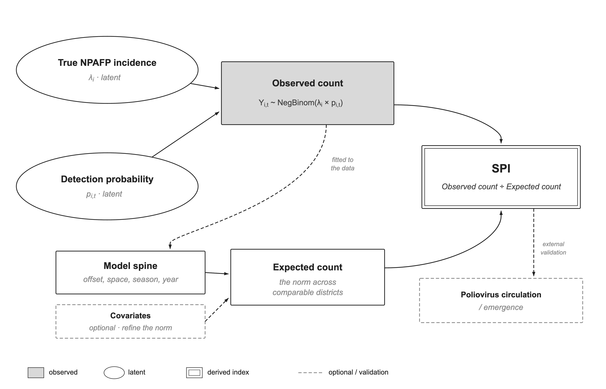
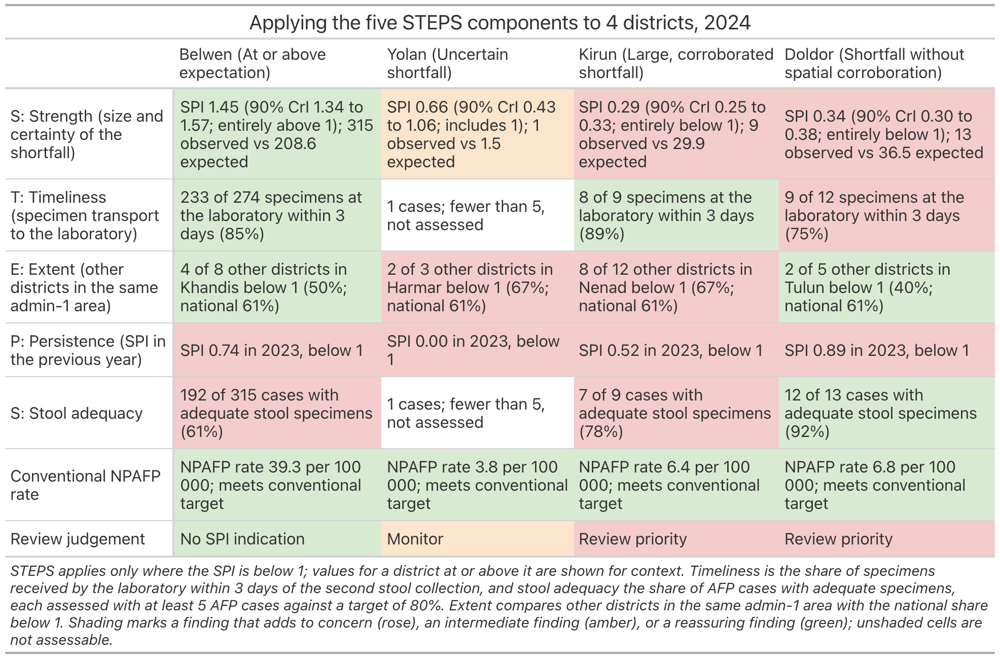

---
output:
  github_document:
    md_extensions: -smart
    html_preview: false
---

<!-- README.md is generated from README.Rmd. Please edit that file, then run
     `devtools::build_readme()` (or knit) to regenerate README.md. -->

```{r setup, include = FALSE, cache = FALSE}
knitr::opts_chunk$set(
  collapse = TRUE,
  comment = "#>",
  fig.path = "man/figures/README-",
  out.width = "100%",
  dpi = 150,
  message = FALSE,
  warning = FALSE,
  cache = TRUE,
  autodep = TRUE
)
# Keep printed output plain ASCII (no unicode x / ... / i in tibble output).
options(cli.unicode = FALSE, width = 80)
# INLA on macOS can abort when it spawns many worker processes; pin it to one
# thread so the README knits without crashing.
if (requireNamespace("INLA", quietly = TRUE)) {
  INLA::inla.setOption(num.threads = "1:1")
}
set.seed(1)
```

# blindspot 

<!-- badges: start -->

[](https://github.com/truenomad/blindspot/actions/workflows/R-CMD-check.yaml)
[](https://codecov.io/gh/truenomad/blindspot)
[](https://github.com/truenomad/blindspot/actions/workflows/pkgdown.yaml)
[](https://opensource.org/licenses/MIT)
[](https://cran.r-project.org/)

<!-- badges: end -->

> **Find the districts where the surveillance system can't see**

_In the districts that report no cases, is the silence real?_

blindspot estimates, for each district in each month, how many cases a surveillance system should be detecting given its health facilities, population, care-seeking patterns, conflict exposure, and the detection history of its neighbours. The ratio of what is detected to what is expected defines a surveillance performance index (SPI): a continuous, uncertainty-quantified measure of detection capacity that refines and corroborates the conventional NPAFP-rate threshold (one example of the flat indicators surveillance leans on) rather than replacing it. It is diagnostic, not predictive: it grades current detection performance, and does not forecast where poliovirus is circulating.

**Designed for polio AFP surveillance. Applicable to any case-based VPD surveillance system.**

The expected count comes from a negative-binomial model of each district-month, and the SPI is the observed count over that expectation:

$$
Y_{it} \sim \text{NegBin}(\mu_{it}, \theta), \qquad \text{SPI}_{it} = \frac{Y_{it}}{\mu_{it}}
$$

$$
\log \mu_{it} = \log(P_{it}/12) + \beta_0 + f(\text{month}_t) + \gamma_{y(t)} + u_i + v_i + x_{it}^{\top}\beta
$$

where

- $\log(P_{it}/12)$ is the log under-15 person-time offset
- $\beta_0$ is the background non-polio AFP detection rate, estimated from the data
- $f(\text{month}_t)$ is harmonic seasonality (12- and 6-month periodicity)
- $\gamma_{y(t)}$ is an exchangeable year effect
- $u_i + v_i$ is a BYM2 spatial random effect (Riebler et al. 2016)
- $x_{it}^{\top}\beta$ is the optional district-covariate term (DTP3 coverage, urbanicity, travel time to care)

<details>
<summary><b>Method notes — estimand, model, and what the SPI is for</b> (click to expand)</summary>

<br>



The observed count is the product of two unobserved processes (true non-polio AFP incidence and detection probability), modelled as a negative-binomial count. Fitted to the data, the model estimates an **expected count** (the level prevailing across comparable districts) from a population offset and spatial, seasonal, and annual terms, with context covariates as an optional refinement; the **SPI is observed ÷ expected**. Poliovirus circulation has no path into the model, so the SPI is diagnostic of *surveillance performance* and does not estimate transmission; it enters only as an independent reference for external validation.

**Why a Bayesian spatial model.** District-month AFP counts are small and noisy, so a raw rate is unstable and a single zero-count month can look like a collapse. The BYM2 spatial effect borrows strength across space, pulling each district toward its neighbours in proportion to how little its own data can say, and returns a full posterior, so the SPI carries a credible interval rather than a bare point estimate. Fitting is by INLA rather than MCMC: for latent Gaussian spatial models of this size, approximate-Bayesian inference is accurate and finishes in seconds to minutes.

**What the SPI is for.** It refines the conventional NPAFP rate rather than replacing it: instead of asking whether a district clears a fixed target, it asks whether the district detects as much as a model of its own context expects, with uncertainty attached. SPI = 1 means detection matches expectation; below 1 flags under-detection (a blindspot). It is diagnostic, not predictive: it grades whether the system *could* see, not whether virus was there.

The core engine is disease-agnostic: it operates on case counts, population denominators, and spatial boundaries. But polio AFP/NPAFP is the key example throughout this package and its paper: the method was built around the polio endgame's surveillance-quality problem, and the NPAFP rate is the flat threshold every worked example refines. Other case-based VPD indicators (measles discard surveillance, DHIS2 reporting completeness, and the like) are supported by analogy: changing the application changes the data and covariates, not the methodology.

A blindspot is a district where the surveillance system cannot see. The package finds them, quantifies the uncertainty, and tells you what to do about them.

</details>

## Installation

```r
# from r-universe (recommended)
install.packages(
  "blindspot",
  repos = c(
    "https://truenomad.r-universe.dev",
    "https://inla.r-inla-download.org/R/stable/",
    "https://cloud.r-project.org"
  )
)

# or from github
pak::pak("truenomad/blindspot")
```

## Walkthrough

This runs the whole chain on the bundled synthetic data, so you can reproduce every step without POLIS access. It is the short version of `inst/examples/paper_analysis.R`, which you can open with `file.edit(system.file("examples/paper_analysis.R", package = "blindspot"))`.

```{r library, cache = FALSE}
library(blindspot)
```

### The data

`synth_surveillance` is a made-up country (Harad): 236 districts across 36 provinces, monthly counts from 2015 to 2024, an under-15 population denominator, district polygons, a genomic outcome, and a ground-truth sheet recording where the blindspots were planted.

```{r data}
synth <- synth_surveillance
names(synth)

head(synth$cases)
```

### Check the inputs first

Before fitting anything, reconcile the three tables the model consumes: the case counts, the population denominators, and the district shapefile. `bs_check_inputs()` grades every mismatch at once (error, warning, note), so a silent id misalignment or a hole in the monthly panel surfaces here rather than as wrong numbers later. `bs_expected()` runs it for you and stops on any error; run it yourself first to see the warnings too.

```{r check-inputs, message = TRUE}
bs_check_inputs(
  cases = synth$cases,
  population = synth$population,
  shapefile = synth$boundaries,
  id_col = "adm2_guid"
)
```

On a broken copy, one negative count and three dropped months, it returns the error that blocks the fit alongside the warnings worth a look:

```{r check-inputs-broken, message = TRUE}
bad <- synth$cases
bad$count[1] <- -1                   # a data-entry slip
bad <- bad[-(2:4), ]                 # three missing district-months

bs_check_inputs(bad, synth$population, synth$boundaries, id_col = "adm2_guid")
```

### 1. Spatial neighbours

The model shares information between neighbouring districts, so the first step turns the polygons into a neighbour graph.

```{r adjacency}
adj <- bs_adjacency(synth$boundaries, id_col = "adm2_guid")
adj
```

### 2. Expected counts

`bs_expected()` is the core model. It estimates how many cases each district should report each month, given its population, its neighbours, and the season. The bare spec is a BYM2 spatial term, an IID year effect (which soaks up system-wide shifts such as the COVID drop), a harmonic season, and IID overdispersion, all on a log person-time offset. The `overdispersion` argument takes `"none"`, `"iid"`, or `"nb"` (negative binomial); pass `"auto"` to have it run the comparison in step 3 for you and refit with the best-calibrated spec.

```{r fit-bare}
fit_bare <- bs_expected(
  cases = synth$cases,
  population = synth$population,
  adjacency = adj,
  id_col = "adm2_guid",
  season = "harmonic",
  year_effect = "iid",
  overdispersion = "iid",
  n_draws = 500,
  seed = 42,
  verbose = FALSE
)
```

The model output is the expected case count for every district-month, with a full posterior. Displayed next to the observed count:

```{r fit-bare-show}
as_tibble(fit_bare) |>
  dplyr::filter(count > 0) |>
  dplyr::select(
    adm2_guid, month, count,
    expected_median, expected_q05, expected_q95
  ) |>
  head()
```

### Adjusting for covariates

For those who want to use their own covariates, such as health-system reach, urbanicity, or access to care, `bs_expected()` takes them as a district-year tibble through the `covariates` argument. The toy ships three you can use straight away:

```{r covariates}
head(synth$covariates)
```

Pass them in, log-transforming the skewed travel-time column:

```{r fit-adjusted}
fit_adj <- bs_expected(
  cases = synth$cases,
  population = synth$population,
  adjacency = adj,
  covariates = synth$covariates,
  log_transform = "travel_time_min",
  id_col = "adm2_guid",
  season = "harmonic",
  year_effect = "iid",
  overdispersion = "iid",
  n_draws = 500,
  seed = 42,
  verbose = FALSE
)
```

Each effect comes back as a rate ratio per standard deviation (the covariates are standardised inside the model). Here are the three covariates, dropping the seasonal harmonic terms:

```{r fit-adjusted-show}
eff <- summary(fit_adj)$effects
eff[eff$covariate %in% c("dtp3", "urban_prop", "travel_time_min"),
    c("covariate", "rr_median", "rr_q025", "rr_q975", "signif")]
```

One caveat, and the table shows it: most of these effects are muted, because the spatial, seasonal, and year terms already absorb the structure the covariates would otherwise carry. These covariates also track surveillance access, which is itself partly a function of detection, so leaning on them can mask the shortfall the SPI is built to catch. Treat the adjusted fit as a sensitivity check and keep the bare model as the main one. The rest of this walk uses `fit_bare`.

### 3. Does the overdispersion term pay for itself?

A quick likelihood check across none, IID, and negative-binomial, so the choice is justified rather than assumed.

```{r overdispersion}
od <- bs_compare_overdispersion(
  cases = synth$cases,
  population = synth$population,
  adjacency = adj,
  id_col = "adm2_guid",
  specs = c("none", "iid", "nb"),
  n_draws = 100,
  verbose = FALSE
)
```

```{r overdispersion-show}
od$summary
```

To skip the manual step, `bs_expected(overdispersion = "auto")` runs this same comparison internally and refits with the recommended spec.

### 4. Surveillance Performance Index

The SPI is observed over expected, computed for every posterior draw so the uncertainty in the denominator carries through. It can be summarised at any grain:

```{r spi}
spi_dy <- bs_spi(fit_bare, level = "district_year")  # annual per district
spi_dm <- bs_spi(fit_bare, level = "district_month")  # monthly per district
```

```{r spi-show}
head(as_tibble(spi_dy)[, c(
  "adm2_guid", "year", "observed", "spi_median", "spi_q05", "spi_q95"
)])
```

**Why the yearly SPI is the one we act on.** The index is defined at any grain, but the verdict is annual. In most districts the monthly AFP count is 0 or 1, so the monthly SPI is mostly structural zeros with credible intervals too wide to act on, and reacting to it spends trust on noise. The sample size only settles over a full year, so the year is the unit we classify. We keep the monthly series to read the trend, and to feed the seasonal signal in the field guide.

The `plot()` method gives four diagnostic views (`distribution`, `funnel`, `caterpillar`, `calibration`). The funnel plots each district-year against its expected count (the paper's Figure 3): detection scatters around 1, and the spread narrows as the expected count grows, so a low SPI at a high expected count is a genuine shortfall rather than small-number noise.

```{r spi-funnel, fig.width = 8, fig.height = 4.5}
plot(spi_dy, type = "funnel")
```

The default `distribution` view is the headline calibration check: a well-fit SPI is roughly log-normal and centred near 1.

```{r spi-distribution, fig.width = 8, fig.height = 4.5}
plot(spi_dy)
```

### 5. Concordance against the conventional threshold

Instead of a hard pass/fail, each district-year's SPI is crossed with the WHO NPAFP-rate target (at least 3 non-polio AFP per 100,000 under-15 person-years) into a 2x2. The cell that matters is false reassurance: the NPAFP rate looks fine, but the SPI still flags under-detection. That is the blindspot a plain threshold walks past.

```{r concordance}
conc <- bs_concordance(
  spi = spi_dy,
  cases = synth$cases,
  population = synth$population,
  boundaries = synth$boundaries,
  verbose = FALSE
)
```

Every district-year lands in one of the four cells:

```{r concordance-show}
table(conc$district_year$concordance)
```

`plot()` shows the four cells as a scatter of NPAFP rate against SPI, split by the two thresholds (dashed). The false-reassurance points sit bottom-right: adequate NPAFP rate, low SPI.

```{r concordance-scatter, fig.width = 8, fig.height = 5}
plot(conc)
```

### 6. The three-panel map

Three panels for one year: the conventional NPAFP rate, the posterior median SPI, and where the two disagree.

```{r maps, fig.width = 15, fig.height = 6}
bs_concordance_maps(conc, boundaries = synth$boundaries, year = 2023)
```

### 7. The seven-signal field guide

`bs_field_guide()` reads each district-year through seven signals (S1 to S7) and lands on a FLAG, WATCH, or No-action verdict. S6 uses the neighbour graph; S7 uses the monthly SPI for seasonality and a table of orphan-virus detections.

The `genomic` argument is that table of independent virus detections: here the district-years where the toy's virus-outcome sheet recorded a cVDPV2 (`any_cvdpv2 == 1`). It is the one corroborator that does *not* come from the AFP stream the guide is grading, so S7 can ask whether a flagged silence also had poliovirus surface there, evidence of a genuine blindspot rather than a false alarm. Pass only the `adm2_guid` and `year` of the detections; any district-year absent from the table is treated as no orphan detection.

```{r field-guide}
genomic <- dplyr::filter(synth$virus_outcome, any_cvdpv2 == 1)

fg <- bs_field_guide(
  concordance = conc,
  adjacency = adj,
  spi_month = spi_dm,
  genomic = genomic[, c("adm2_guid", "year")],
  verbose = FALSE
)

fg
```

`summary(fg)` adds the signal fire-counts and a reference for the seven signals, and `bs_field_guide_help()` walks a worked example in the console.

For a report, `bs_field_guide_table()` renders the worked example as a publication-ready `gt` or `flextable`: the rule-picked archetype districts (by name) read down the seven signals, each cell shaded by concern. (The image below is a snapshot; the live call returns a `gt` object whose cell shading GitHub would otherwise strip.)

```{r fg-table-code, eval = FALSE}
bs_field_guide_table(fg, engine = "gt", layout = "worked")
```

```{r fg-table, echo = FALSE, fig.alt = "Field guide table: four districts read down the seven signals, cells shaded green for reassuring, amber for watch, and red for adverse."}
fg_tbl <- bs_field_guide_table(fg, engine = "gt", layout = "worked")
gt::gtsave(fg_tbl, "man/figures/README-fg-table.png", expand = 5)

```

<!-- Section 8 (Triangulation) is temporarily dropped from the rendered docs.
     To restore, delete this comment wrapper and drop the `eval = FALSE` chunk
     options below.

### 8. Triangulating the verdict against independent detection

The field guide judges the *net*, not the *fish*: a FLAG says a silence is untrustworthy, not that the silence hid virus. Every signal it uses comes from the AFP stream itself, so it cannot corroborate its own verdict without arguing in a circle. `bs_triangulate()` crosses the verdict against the one largely-independent channel, environmental surveillance (ES), and against AFP detections, and sorts each district-year into a ten-class triage grid with a three-level priority.

```{r triangulate, eval = FALSE}
tri <- bs_triangulate(
  fg,
  detections = synth_surveillance$detections,
  detection_lag = 1L,
  verbose = FALSE
)

# the ten classes are a verdict x ES-status grid (AFP-detected sits off-grid)
tri$district_year |>
  dplyr::filter(!afp_hit) |>
  dplyr::mutate(
    verdict = factor(verdict_chr, c("FLAG", "WATCH", "No action")),
    ES = factor(es_status, c("positive", "clear", "no site"))
  ) |>
  dplyr::count(verdict, ES, .drop = FALSE) |>
  tidyr::pivot_wider(names_from = ES, values_from = n, values_fill = 0)
```

Read as a grid, the field-guide verdict runs down the rows and the independent ES read across the columns, so every cell is one triage class. `detection_lag = 1L` tests the year-*t* verdict against year *t + 1* detections, so the capacity read is taken before the detection's own case-finding could inflate it. The cells that carry the weight sit off the reassuring bottom-right: **FLAG × positive** (confirmed blindspots, where ES caught what AFP missed), **No action × positive** (possible false-adequates the guide waved through), and **FLAG × no site** (flagged with no ES site to check, the highest-value place to deploy ES or an active search). The district-years where AFP itself already detected virus sit outside the grid.

```{r tri-map, eval = FALSE, fig.width = 9, fig.height = 7}
bs_triangulate_map(tri, synth_surveillance$boundaries, year = 2020)
```

The 2020 verdicts (the COVID-crash trough, tested against 2021 detections) map the triage: reds and magenta are the districts to act on or instrument, greens the trustworthy silences. `bs_triangulate_table()` renders the same panel as a `gt` / `flextable` for a report.

```{r tri-table, eval = FALSE, results = "asis"}
bs_triangulate_table(tri, engine = "gt", year = 2020) |>
  gt::as_raw_html()
```

-->

## Exported functions

```r
bs_check_inputs()           # pre-flight: reconcile cases / population / shapefile
bs_adjacency()              # spatial neighbour graph from sf boundaries
bs_expected()               # fit BYM2 expected-count model (INLA)
bs_compare_overdispersion() # none vs IID vs negative-binomial diagnostic
bs_spi()                    # surveillance performance index + posterior draws
bs_concordance()            # cross-classify SPI vs the NPAFP-rate threshold
bs_concordance_maps()       # three-panel concordance map (ggplot2/patchwork)
bs_field_guide()            # read SPI to FLAG / WATCH / No-action verdicts
bs_field_guide_table()      # render the field guide (gt / flextable)
bs_field_guide_help()       # learn to read the field guide (worked example)
bs_triangulate()            # cross the verdict with ES / AFP detection channels
bs_triangulate_table()      # render the triangulation panel (gt / flextable)
bs_triangulate_map()        # map the triage classes over districts (ggplot2)
```

`bs_expected()`, `bs_spi()`, `bs_concordance()`, `bs_field_guide()`, and
`bs_triangulate()` each return a typed object with `print` (and, where useful,
`summary` / `as_tibble`) methods; the `bs_spi()` and `bs_concordance()` objects
also have a `plot()` method.

## Citation

```r
Yusuf MA (2026). blindspot: Bayesian spatiotemporal
  surveillance quality monitoring. R package version 0.1.0.
  https://github.com/truenomad/blindspot
```

## Related packages

**poliprep:** POLIS data cleaning and preparation. Upstream of blindspot.

**AgePopDenom:** DHS-anchored age-structured population estimates. Provides the denominator input.

## License

MIT (c) 2026 Mohamed A. Yusuf
