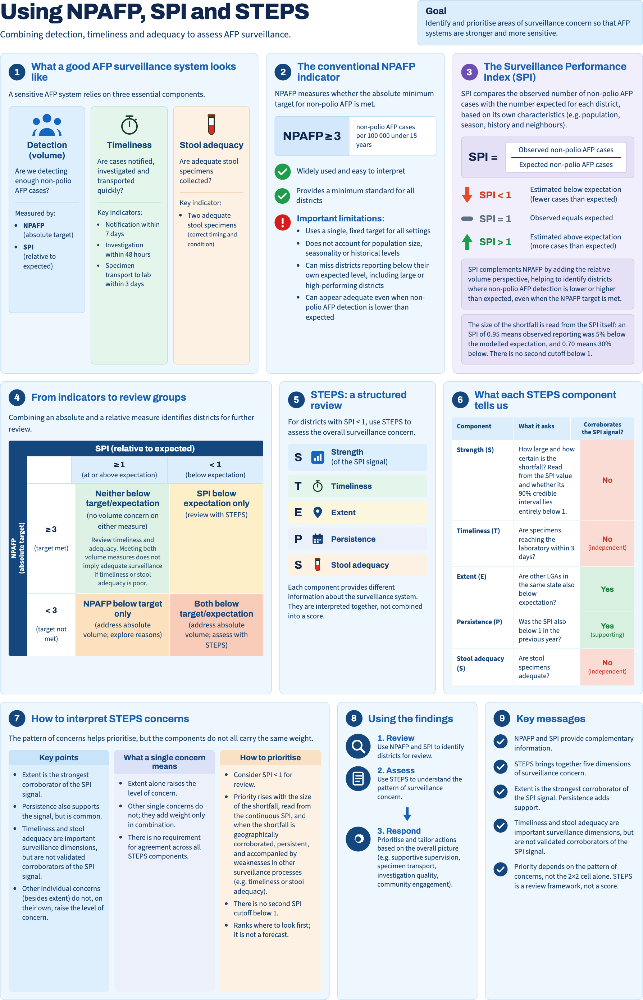

---
output:
  github_document:
    md_extensions: -smart
    html_preview: false
---

<!-- README.md is generated from README.Rmd. Please edit that file, then run
     `devtools::build_readme()` (or knit) to regenerate README.md. -->

```{r setup, include = FALSE, cache = FALSE}
knitr::opts_chunk$set(
  collapse = TRUE,
  comment = "#>",
  fig.path = "man/figures/README-",
  out.width = "100%",
  dpi = 150,
  message = FALSE,
  warning = FALSE,
  cache = TRUE,
  autodep = TRUE
)
# Keep printed output plain ASCII (no unicode x / ... / i in tibble output).
options(cli.unicode = FALSE, width = 80)
# INLA on macOS can abort when it spawns many worker processes; pin it to one
# thread so the README knits without crashing.
if (requireNamespace("INLA", quietly = TRUE)) {
  INLA::inla.setOption(num.threads = "1:1")
}
set.seed(1)
```

# spi 

<!-- badges: start -->

[](https://github.com/truenomad/spi/actions/workflows/R-CMD-check.yaml)
[](https://codecov.io/gh/truenomad/spi)
[](https://github.com/truenomad/spi/actions/workflows/pkgdown.yaml)
[](https://opensource.org/licenses/MIT)
[](https://cran.r-project.org/)

<!-- badges: end -->

> **Find the districts where the surveillance system can't see**

_In the districts that report no cases, is the silence real?_

spi estimates, for each district in each month, how many cases a surveillance system should be detecting given its health facilities, population, care-seeking patterns, conflict exposure, and the detection history of its neighbours. The ratio of what is detected to what is expected defines a surveillance performance index (SPI): a continuous, uncertainty-quantified measure of detection capacity that refines and corroborates the conventional NPAFP-rate threshold (one example of the flat indicators surveillance leans on) rather than replacing it. It is diagnostic, not predictive: it grades current detection performance, and does not forecast where poliovirus is circulating.

**Designed for polio AFP surveillance. Applicable to any case-based VPD surveillance system.**

The expected count comes from a Bayesian spatiotemporal count model of each district-month, and the SPI is the observed count over that expectation:

$$
Y_{it} \sim \text{NegBin}(\mu_{it}, \kappa), \qquad \text{SPI}_{it} = \frac{Y_{it}}{\mu_{it}}
$$

$$
\log \mu_{it} = \log(P_{it}/12) + \beta_0 + f(\text{month}_t) + \gamma_{y(t)} + u_i + v_i + x_{it}^{\top}\beta
$$

where

- $\log(P_{it}/12)$ is the log under-15 person-time offset
- $\beta_0$ is the background non-polio AFP detection rate, estimated from the data
- $f(\text{month}_t)$ is harmonic seasonality (12- and 6-month periodicity)
- $\gamma_{y(t)}$ is an exchangeable year effect
- $u_i + v_i$ is a BYM2 spatial random effect (Riebler et al. 2016)
- $\kappa$ is the negative binomial dispersion, the default `overdispersion = "nb"`
- $x_{it}^{\top}\beta$ is the optional district-covariate term (DTP3 coverage, urbanicity, travel time to care)

`overdispersion = "iid"` swaps the negative binomial likelihood for Poisson plus an observation-level term $\epsilon_{it}$ added to the linear predictor, and `"none"` drops overdispersion and fits a plain Poisson; `spi_compare_overdispersion()` scores the three so the choice is justified rather than assumed.

<details>
<summary><b>Method notes — estimand, model, and what the SPI is for</b> (click to expand)</summary>

<br>


The observed count is the product of two unobserved processes (true non-polio AFP incidence and detection probability), modelled as an overdispersed count. Fitted to the data, the model estimates an **expected count** (the level prevailing across comparable districts) from a population offset and spatial, seasonal, and annual terms, with context covariates as an optional refinement; the **SPI is observed ÷ expected**. Poliovirus circulation has no path into the model, so the SPI is diagnostic of *surveillance performance* and does not estimate transmission; it enters only as an independent reference for external validation.

**Why a Bayesian spatial model.** District-month AFP counts are small and noisy, so a raw rate is unstable and a single zero-count month can look like a collapse. The BYM2 spatial effect borrows strength across space, pulling each district toward its neighbours in proportion to how little its own data can say, and returns a full posterior, so the SPI carries a credible interval rather than a bare point estimate. Fitting is by INLA rather than MCMC: for latent Gaussian spatial models of this size, approximate-Bayesian inference is accurate and finishes in seconds to minutes.

**What the SPI is for.** It refines the conventional NPAFP rate rather than replacing it: instead of asking whether a district clears a fixed target, it asks whether the district detects as much as a model of its own context expects, with uncertainty attached. SPI = 1 means detection matches expectation; below 1 flags under-detection (a blindspot). It is diagnostic, not predictive: it grades whether the system *could* see, not whether virus was there.

The core engine is disease-agnostic: it operates on case counts, population denominators, and spatial boundaries. But polio AFP/NPAFP is the key example throughout this package and its paper: the method was built around the polio endgame's surveillance-quality problem, and the NPAFP rate is the flat threshold every worked example refines. Other case-based VPD indicators (measles discard surveillance, DHIS2 reporting completeness, and the like) are supported by analogy: changing the application changes the data and covariates, not the methodology.

A blindspot is a district where the surveillance system cannot see. The package finds them, quantifies the uncertainty, and tells you what to do about them.

</details>

## Installation

```r
# from r-universe (recommended)
install.packages(
  "spi",
  repos = c(
    "https://truenomad.r-universe.dev",
    "https://cloud.r-project.org"
  )
)

# or from github
pak::pak("truenomad/spi")
```

## Walkthrough

This runs the whole chain on the bundled synthetic data, so you can reproduce every step without POLIS access. It is the short version of `inst/examples/paper_analysis.R`, which you can open with `file.edit(system.file("examples/paper_analysis.R", package = "spi"))`.

```{r library, cache = FALSE}
library(spi)
```

### The data

`synth_surveillance` is a made-up country (Harad): 236 districts across 36 provinces, monthly counts from 2015 to 2024, an under-15 population denominator, district polygons, a genomic outcome, and a ground-truth sheet recording where the blindspots were planted.

```{r data}
synth <- synth_surveillance
names(synth)

head(synth$cases)
```

### Check the inputs first

Before fitting anything, reconcile the three tables the model consumes: the case counts, the population denominators, and the district shapefile. `spi_check_inputs()` grades every mismatch at once (error, warning, note), so a silent id misalignment or a hole in the monthly panel surfaces here rather than as wrong numbers later. `spi_expected()` runs it for you and stops on any error; run it yourself first to see the warnings too.

```{r check-inputs, message = TRUE}
spi_check_inputs(
  cases = synth$cases,
  population = synth$population,
  shapefile = synth$boundaries,
  id_col = "adm2_guid"
)
```

On a broken copy, one negative count and three dropped months, it returns the error that blocks the fit alongside the warnings worth a look:

```{r check-inputs-broken, message = TRUE}
bad <- synth$cases
bad$count[1] <- -1                   # a data-entry slip
bad <- bad[-(2:4), ]                 # three missing district-months

spi_check_inputs(bad, synth$population, synth$boundaries, id_col = "adm2_guid")
```

### 1. Spatial neighbours

The model shares information between neighbouring districts, so the first step turns the polygons into a neighbour graph.

```{r adjacency}
adj <- spi_adjacency(synth$boundaries, id_col = "adm2_guid")
adj
```

### 2. Expected counts

`spi_expected()` is the core model. It estimates how many cases each district should report each month, given its population, its neighbours, and the season. The bare spec, and the paper's own, is a BYM2 spatial term, an IID year effect (which soaks up system-wide shifts such as the COVID drop), a harmonic season, and negative binomial overdispersion, all on a log person-time offset. The `overdispersion` argument takes `"nb"` (default), `"iid"`, or `"none"`; pass `"auto"` to have it run the comparison in step 3 for you and refit with the best-calibrated spec.

```{r fit-bare}
fit_bare <- spi_expected(
  cases = synth$cases,
  population = synth$population,
  adjacency = adj,
  id_col = "adm2_guid",
  n_draws = 500,
  seed = 42,
  verbose = FALSE
)
```

The model output is the expected case count for every district-month, with a full posterior. Displayed next to the observed count:

```{r fit-bare-show}
as_tibble(fit_bare) |>
  dplyr::filter(count > 0) |>
  dplyr::select(
    adm2_guid, month, count,
    expected_median, expected_q05, expected_q95
  ) |>
  head()
```

### Adjusting for covariates

For those who want to use their own covariates, such as health-system reach, urbanicity, or access to care, `spi_expected()` takes them as a district-year tibble through the `covariates` argument. The toy ships three you can use straight away:

```{r covariates}
head(synth$covariates)
```

Pass them in, log-transforming the skewed travel-time column:

```{r fit-adjusted}
fit_adj <- spi_expected(
  cases = synth$cases,
  population = synth$population,
  adjacency = adj,
  covariates = synth$covariates,
  log_transform = "travel_time_min",
  id_col = "adm2_guid",
  n_draws = 500,
  seed = 42,
  verbose = FALSE
)
```

Each effect comes back as a rate ratio per standard deviation (the covariates are standardised inside the model). Here are the three covariates, dropping the seasonal harmonic terms:

```{r fit-adjusted-show}
eff <- summary(fit_adj)$effects
eff[eff$covariate %in% c("dtp3", "urban_prop", "travel_time_min"),
    c("covariate", "rr_median", "rr_q025", "rr_q975", "signif")]
```

One caveat, and the table shows it: most of these effects are muted, because the spatial, seasonal, and year terms already absorb the structure the covariates would otherwise carry. These covariates also track surveillance access, which is itself partly a function of detection, so leaning on them can mask the shortfall the SPI is built to catch. Treat the adjusted fit as a sensitivity check and keep the bare model as the main one. The rest of this walk uses `fit_bare`.

### 3. Does the overdispersion term pay for itself?

A quick likelihood check across none, IID, and negative-binomial, so the choice is justified rather than assumed.

```{r overdispersion}
od <- spi_compare_overdispersion(
  cases = synth$cases,
  population = synth$population,
  adjacency = adj,
  id_col = "adm2_guid",
  specs = c("none", "iid", "nb"),
  n_draws = 100,
  verbose = FALSE
)
```

```{r overdispersion-show}
od$summary
```

To skip the manual step, `spi_expected(overdispersion = "auto")` runs this same comparison internally and refits with the recommended spec.

### 4. Surveillance Performance Index

The SPI is observed over expected, computed for every posterior draw so the uncertainty in the denominator carries through. It can be summarised at any grain:

```{r spi}
spi_dy <- spi_index(fit_bare, level = "district_year")  # annual per district
spi_dm <- spi_index(fit_bare, level = "district_month")  # monthly per district
```

```{r spi-show}
head(as_tibble(spi_dy)[, c(
  "adm2_guid", "year", "observed", "spi_median", "spi_q05", "spi_q95"
)])
```

**Why the yearly SPI is the one we act on.** The index is defined at any grain, but the verdict is annual. In most districts the monthly AFP count is 0 or 1, so the monthly SPI is mostly structural zeros with credible intervals too wide to act on, and reacting to it spends trust on noise. The sample size only settles over a full year, so the year is the unit we classify. We keep the monthly series to read the trend, and to feed the seasonal signal in the field guide.

The reading year does not have to be a calendar year. `spi_index(level = "district_year", year_end_month = 4)` groups May through April, so a review can close on the month the decision was actually taken; each window is labelled by the calendar year it closes in, and the returned `n_months` marks the partial windows at either end of the series, which should normally be dropped.

The `plot()` method gives four diagnostic views (`distribution`, `funnel`, `caterpillar`, `calibration`). The funnel plots each district-year against its expected count (the paper's Figure 3): detection scatters around 1, and the spread narrows as the expected count grows, so a low SPI at a high expected count is a genuine shortfall rather than small-number noise.

```{r spi-funnel, fig.width = 8, fig.height = 4.5}
plot(spi_dy, type = "funnel")
```

The default `distribution` view is the headline calibration check: a well-fit SPI is roughly log-normal and centred near 1.

```{r spi-distribution, fig.width = 8, fig.height = 4.5}
plot(spi_dy)
```

### 5. Concordance against the conventional threshold

Instead of a hard pass/fail, each district-year's SPI is crossed with the WHO NPAFP-rate target (at least 3 non-polio AFP per 100,000 under-15 person-years) into a 2x2. The cell that matters is false reassurance: the NPAFP rate looks fine, but the SPI still flags under-detection. That is the blindspot a plain threshold walks past.

```{r concordance}
conc <- spi_concordance(
  spi = spi_dy,
  cases = synth$cases,
  population = synth$population,
  boundaries = synth$boundaries,
  verbose = FALSE
)
```

Every district-year lands in one of the four cells:

```{r concordance-show}
table(conc$district_year$concordance)
```

`plot()` shows the four cells as a scatter of NPAFP rate against SPI, split by the two thresholds (dashed). The false-reassurance points sit bottom-right: adequate NPAFP rate, low SPI.

```{r concordance-scatter, fig.width = 8, fig.height = 5}
plot(conc)
```

### 6. The three-panel map

Three panels for one year: the conventional NPAFP rate, the posterior median SPI, and where the two disagree.

```{r maps, fig.width = 15, fig.height = 6}
spi_concordance_maps(conc, boundaries = synth$boundaries, year = 2023)
```

### 7. The STEPS field guide

`spi_field_guide()` applies the SPI field guide's review framework to each district-year. For districts with an SPI below 1, five components, **STEPS**, help assess the wider surveillance picture:

| Letter | Component | What it asks |
| --- | --- | --- |
| S | Strength | How large and how certain is the shortfall? Read from the SPI value and whether its 90% credible interval lies entirely below 1. |
| T | Timeliness | Are specimens reaching the laboratory within 3 days? |
| E | Extent | Are other districts in the same admin-1 area (other LGAs in the same state) also below expectation? |
| P | Persistence | Was the SPI also below 1 in the previous year? |
| S | Stool adequacy | Are stool specimens adequate? |

The components are interpreted together, not combined into a score, and they do not carry the same weight. Extent is the strongest corroborator of the SPI signal. Persistence also supports it, but is common. Timeliness and stool adequacy are important surveillance dimensions, but are not validated corroborators, so they are reported and never change the judgement. Each district-year receives one of the field guide's three review judgements: **Review priority** when the interval lies entirely below 1 and extent or persistence corroborates the shortfall, **Monitor** for any other SPI below 1, and **No SPI indication** at or above 1.

Timeliness and stool adequacy come from `process`, a district-year table of AFP case counts (`n_cases`, `n_adequate`, `n_transport`, `n_transport_timely`). Extent uses the `adm1_name` column that `spi_concordance()` carries when given `boundaries`. The trend, the neighbour contrast, seasonal detection and any poliovirus found through AFP (`genomic`) or environmental surveillance (`es`) are still computed and reported as context outside STEPS.

The one-page infographic that summarises NPAFP, the SPI and STEPS ships with the package at `system.file("field-guide", "npafp_spi_steps_infographic.html", package = "spi")`.

<details>
<summary>Using NPAFP, SPI and STEPS (infographic)</summary>



</details>

```{r field-guide}
genomic <- dplyr::filter(synth$virus_outcome, any_cvdpv2 == 1)

fg <- spi_field_guide(
  concordance = conc,
  process = synth$afp_process,
  adjacency = adj,
  spi_month = spi_dm,
  genomic = genomic[, c("adm2_guid", "year")],
  es = synth$es_district_year,
  es_col = "n_positive",
  verbose = FALSE
)

fg
```

`summary(fg)` adds how often each STEPS component raises concern and the STEPS reference table, and `spi_field_guide_help()` walks the field guide's four worked examples in the console.

For a report, `spi_field_guide_table()` renders the worked example as a publication-ready `gt` or `flextable`: four rule-picked districts (by name) read down the five STEPS components, each cell shaded by concern. (The image below is a snapshot; the live call returns a `gt` object whose cell shading GitHub would otherwise strip.)

```{r fg-table-code, eval = FALSE}
spi_field_guide_table(fg, engine = "gt", layout = "worked")
```

```{r fg-table, echo = FALSE, fig.alt = "Field guide table: four districts read down the five STEPS components, cells shaded green for reassuring, amber for intermediate, and rose where the finding adds to concern."}
fg_tbl <- spi_field_guide_table(fg, engine = "gt", layout = "worked")
gt::gtsave(fg_tbl, "man/figures/README-fg-table.png", expand = 5)
knitr::include_graphics("man/figures/README-fg-table.png")
```

For the one district you are about to investigate, `spi_field_guide_pager()` renders a single-district **field pager**: a self-contained, print-ready A4 tear-sheet. Hand it the field guide and the shapefile and it draws everything it needs from those two, with no adjacency object required. The masthead carries the review judgement; the chart plots the district's own SPI (with the 90% credible-interval ribbon and AFP / ES detection markers) and a locator inset drawn from the real geometry, with the neighbour median read out as a figure rather than a line; the five STEPS components are read out one per row, with the season, trend and detections shown as context; and a banner states what the judgement rests on. The pager reports the reading and recommends no follow-up, and it is explicit about the limits of the credible interval: that interval carries uncertainty in the *expected* count, not sampling variability in the observed one, so a shortfall resting on a handful of cases says so on its face. `path` writes an auto-named `spi_<adm0>_<adm1>_<adm2>_field_pager.{html,png}`. Three optional arguments add context the field guide does not carry itself: `region` places the district in its region with a rank that is triage only, `year_label` names a reading window that is not a calendar year, and `prob_under` prints the posterior `P(SPI < 1)` on the strength line, which is otherwise only pass or fail.

```{r pager-code, eval = FALSE}
spi_field_guide_pager(
  fg, district = "Tirwen", boundaries = synth$boundaries,
  id_col = "adm2_guid", path = "reports/"
)
```

<details>
<summary>One-page field pager for a review priority district</summary>

```{r pager-img, echo = FALSE, fig.alt = "One-page SPI field pager: masthead judgement, an SPI-over-time chart with a credible-interval ribbon and a locator inset, the five STEPS components, and a judgement banner."}
priority <- fg$focal$verdict == "Review priority" & fg$focal$observed > 0
pager_id <- fg$focal$adm2_guid[priority][
  which.min(fg$focal$spi_median[priority])
]
spi_field_guide_pager(
  fg, district = pager_id, boundaries = synth$boundaries,
  id_col = "adm2_guid", file = "man/figures/README-pager.png",
  verbose = FALSE
)
knitr::include_graphics("man/figures/README-pager.png")
```

</details>

<!-- Section 8 (Triangulation) is temporarily dropped from the rendered docs.
     To restore, delete this comment wrapper and drop the `eval = FALSE` chunk
     options below.

### 8. Triangulating the judgement against independent detection

The field guide judges the *net*, not the *fish*: a review priority says a silence may be untrustworthy, not that the silence hid virus. Every component it uses comes from the AFP stream itself, so it cannot corroborate its own judgement without arguing in a circle. `spi_triangulate()` crosses the judgement against the one largely-independent channel, environmental surveillance (ES), and against AFP detections, and sorts each district-year into a ten-class triage grid with a three-level priority.

```{r triangulate, eval = FALSE}
tri <- spi_triangulate(
  fg,
  detections = synth_surveillance$detections,
  detection_lag = 1L,
  verbose = FALSE
)

# the classes are a judgement x ES-status grid (AFP-detected is off-grid)
tri$district_year |>
  dplyr::filter(!afp_hit) |>
  dplyr::mutate(
    verdict = factor(verdict_chr, c("Review priority", "Monitor",
                                    "No SPI indication")),
    ES = factor(es_status, c("positive", "clear", "no site"))
  ) |>
  dplyr::count(verdict, ES, .drop = FALSE) |>
  tidyr::pivot_wider(names_from = ES, values_from = n, values_fill = 0)
```

Read as a grid, the field-guide judgement runs down the rows and the independent ES read across the columns, so every cell is one triage class. `detection_lag = 1L` tests the year-*t* judgement against year *t + 1* detections, so the reading is taken before the detection's own case-finding could inflate it. The cells that carry the weight sit off the reassuring bottom-right: **Review priority × positive** (confirmed blindspots, where ES caught what AFP missed), **No SPI indication × positive** (virus found where the guide saw no shortfall), **Review priority × no site** (a priority with no ES site to check, the highest-value place to deploy ES or an active search), and **Monitor × positive** (a monitored shortfall that the ES hit corroborates). The district-years where AFP itself already detected virus sit outside the grid.

```{r tri-map, eval = FALSE, fig.width = 9, fig.height = 7}
spi_triangulate_map(tri, synth_surveillance$boundaries, year = 2020)
```

The 2020 judgements (the COVID-crash trough, tested against 2021 detections) map the triage: reds and magenta are the districts to act on or instrument, greens the trustworthy silences. `spi_triangulate_table()` renders the same panel as a `gt` / `flextable` for a report.

```{r tri-table, eval = FALSE, results = "asis"}
spi_triangulate_table(tri, engine = "gt", year = 2020) |>
  gt::as_raw_html()
```

-->

## Exported functions

```r
spi_check_inputs()           # pre-flight: reconcile cases / population / shapefile
spi_adjacency()              # spatial neighbour graph from sf boundaries
spi_expected()               # fit BYM2 expected-count model (INLA)
spi_compare_overdispersion() # none vs IID vs negative-binomial diagnostic
spi_index()                  # surveillance performance index + posterior draws
spi_prospective()            # annually updated index from past years only
spi_concordance()            # cross-classify SPI vs the NPAFP-rate threshold
spi_concordance_maps()       # three-panel concordance map (ggplot2/patchwork)
spi_field_guide()            # STEPS review: priority / monitor / no indication
spi_field_guide_table()      # render the field guide (gt / flextable)
spi_field_guide_pager()      # one-district A4 field pager (html / png)
spi_field_guide_help()       # learn to read the field guide (worked example)
spi_triangulate()            # cross the judgement with ES / AFP detections
spi_triangulate_table()      # render the triangulation panel (gt / flextable)
spi_triangulate_map()        # map the triage classes over districts (ggplot2)
```

`spi_expected()`, `spi_index()`, `spi_concordance()`, `spi_field_guide()`, and
`spi_triangulate()` each return a typed object with `print` (and, where useful,
`summary` / `as_tibble`) methods; the `spi_index()` and `spi_concordance()` objects
also have a `plot()` method.

## Citation

```r
Yusuf MA (2026). spi: Bayesian spatiotemporal
  surveillance quality monitoring. R package version 0.1.0.9000.
  https://github.com/truenomad/spi
```

## Related packages

**poliprep:** POLIS data cleaning and preparation. Upstream of spi.

**AgePopDenom:** DHS-anchored age-structured population estimates. Provides the denominator input.

## License

MIT (c) 2026 Mohamed A. Yusuf
