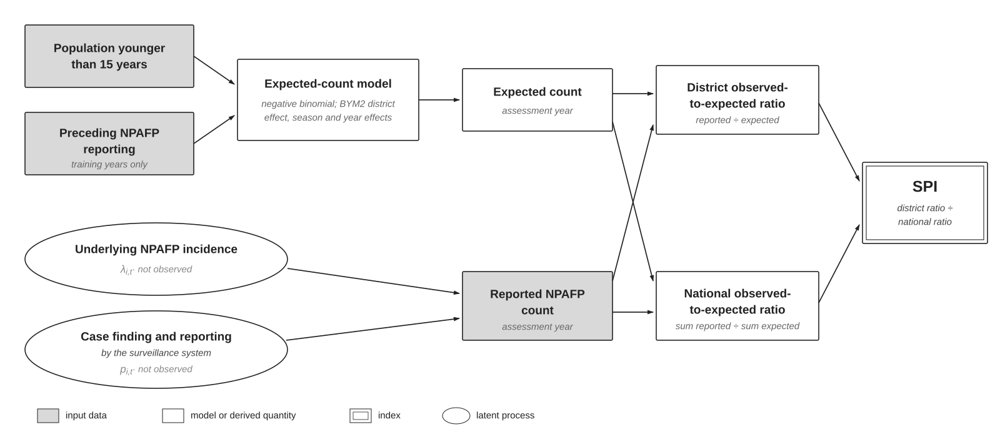
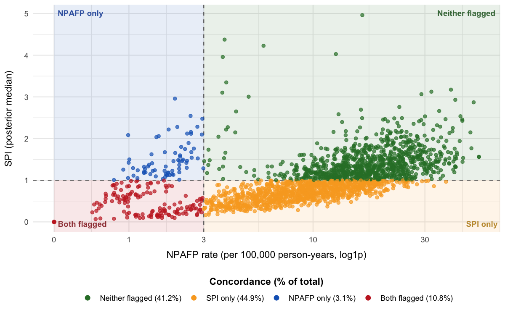
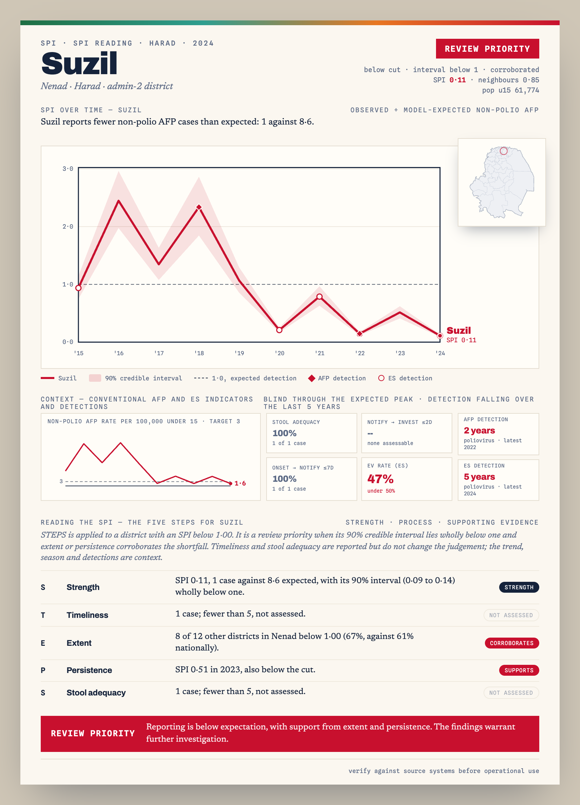

<!-- README.md is generated from README.Rmd. Please edit that file, then run
     `devtools::build_readme()` (or knit) to regenerate README.md. -->

# spi 

<!-- badges: start -->

[](https://github.com/truenomad/spi/actions/workflows/R-CMD-check.yaml)
[](https://codecov.io/gh/truenomad/spi)
[](https://github.com/truenomad/spi/actions/workflows/pkgdown.yaml)
[](https://opensource.org/licenses/MIT)
[](https://cran.r-project.org/)

<!-- badges: end -->

spi is an R package for identifying relative shortfalls in acute flaccid
paralysis (AFP) reporting. It compares reported non-polio AFP (NPAFP)
counts with modelled expectations based on reporting history and
population, and centres the ratio on the national pattern by default.
Use SPI alongside the conventional NPAFP rate, timeliness, and specimen
quality.

## Installation

Install from GitHub:

``` r
# Install pak if needed
if (!requireNamespace("pak", quietly = TRUE)) install.packages("pak")
pak::pak("truenomad/spi")
```

Model fitting requires INLA. If it is not installed, run:

``` r
install.packages(
  "INLA",
  repos = c("https://cloud.r-project.org", "https://inla.r-inla-download.org/R/stable/")
)
```

## Overview

Start with monthly case counts, annual under-15 population estimates,
and district boundaries. spi fits expected counts, calculates annual or
monthly SPI with credible intervals, and produces plots and maps. It
also compares SPI with the conventional NPAFP target and brings
reporting volume, timeliness, and specimen quality together in a STEPS
field guide.

A historically high-reporting district can decline substantially and
still meet the conventional NPAFP target. SPI can identify that relative
shortfall, especially when expectations are estimated from preceding
years. Conversely, years of low reporting can become the model's
expected baseline, leaving SPI near 1 despite low absolute reporting.
The conventional target remains necessary to identify that persistent
shortfall.

<details>

<summary>

SPI methods and limitations
</summary>

### How SPI works

| Building block | What it contributes |
|----|----|
| Reporting history | Provides a reference for each district's reporting. `spi_prospective()` uses preceding years only; a retrospective `spi_expected()` fit uses the full period supplied, including the years being assessed. |
| Population adjustment | Uses the under-15 population as an offset when estimating expected counts. |
| Partial pooling | Pulls estimates with little supporting data towards patterns in the wider dataset, reducing variation due to sparse counts. |
| Neighbour borrowing | Lets neighbouring districts inform the spatial estimate, with more influence where a district's own data provide little information. |
| Seasonality and year effects | Accounts for recurring within-year patterns and differences between years. |
| National centring (default) | Divides the district's observed-to-expected ratio by the national ratio for the same period. Annual SPI therefore describes reporting relative to that year's national pattern. |
| Uncertainty | Provides posterior medians and credible intervals for the ratio, reflecting uncertainty in expected counts. |

In the accompanying study, preceding district reporting provided most of
the longitudinal reference; partial pooling and spatial borrowing
mattered more where district information was sparse.

#### Model specification

The default model without covariates estimates expected counts for each
district-month:

$$
Y_{it} \sim \text{NegBin}(\mu_{it}, \kappa)
$$

$$
\log \mu_{it} = \log(P_{it}/12) + \beta_0 + f(\text{month}_t) + \gamma_{y(t)} + u_i + v_i
$$

where

- $\log(P_{it}/12)$ is the log under-15 person-time offset
- $\beta_0$ is the background reported NPAFP rate, estimated from the
  data
- $f(\text{month}_t)$ is harmonic seasonality (12- and 6-month
  periodicity)
- $\gamma_{y(t)}$ is an exchangeable year effect
- $u_i + v_i$ is a BYM2 spatial random effect (Riebler et al. 2016)
- $\kappa$ is the negative binomial dispersion, the default
  `overdispersion = "nb"`

Optional covariates add $x_{it}^{\top}\beta$ to the linear predictor.
They are not part of the default SPI used in the accompanying study.

`overdispersion = "iid"` uses a Poisson model with an observation-level
term $\epsilon_{it}$ in the linear predictor. `"none"` fits a Poisson
model without overdispersion. Use `spi_compare_overdispersion()` to
compare the three options.



Reported counts reflect both underlying NPAFP incidence and surveillance
reporting. For annually updated SPI, `spi_prospective()` uses preceding
years only; retrospective fits use all supplied years.

**National centring.** For district $i$ and year $y$, let $O_{iy}$ be
the annual observed count and $E_{iy}$ the expected count summed across
months. The default index is:

$$
\text{SPI}_{iy} = \frac{O_{iy}/E_{iy}}{r_y}, \qquad
r_y = \frac{\sum_i O_{iy}}{\sum_i \widetilde{E}_{iy}}
$$

Here $\widetilde{E}_{iy}$ is the posterior median expected count. The
national ratio $r_y$ is held fixed when scaling posterior draws.
`centre = "none"` returns the uncentred observed-to-expected ratio.

### Limitations

These limits follow from how the reference is estimated and how the
ratio is centred:

| Limitation | What to check |
|----|----|
| Persistent low reporting can become the baseline | A district with years of low reporting can have an SPI near 1. Keep the conventional NPAFP target as an external benchmark; persistent failure to meet it remains a reason for closer review. |
| National change is removed when `centre = "national"` | Review the national observed-to-expected ratio in `spi_dy$national` separately. SPI describes relative district differences, so a shared decline can leave district SPI values largely unchanged. Also inspect absolute reporting rates and counts. |
| Population and boundary errors affect the comparison | Population error affects both expected counts and the conventional rate. Check denominators and use consistent boundaries across years, especially after district splits or mergers. |
| Limited history means more reliance on shared information | Sparse reporting histories give the model less district-specific information. Review the available history and uncertainty before interpreting changes. |
| Spatial borrowing can smooth local differences | Sharing information improves stability but can pull an unusual district towards its neighbours. Check local counts and context when the fitted expectation seems implausible. |
| Results depend on model choices | The training period, spatial structure, seasonality, priors, and centring affect results. Keep these choices consistent when comparing years and assess sensitivity to plausible alternatives. |

SPI does not directly estimate missed cases, detection probability,
poliovirus circulation, outbreak risk, or overall surveillance quality.

</details>

## Quick start

The bundled `synth_surveillance` data cover 236 districts in the
fictional country Harad, from 2015 to 2024. This example fits the
supplied years together, with no covariates. For annually updated
estimates based on preceding years only, use `spi_prospective()`.

``` r
library(spi)
```

``` r
synth <- synth_surveillance
```

Fit expected monthly counts, passing the district boundaries directly:

``` r
fit_bare <- spi_expected(
  cases = synth$cases,
  population = synth$population,
  adjacency = synth$boundaries,
  id_col = "adm2_guid",
  n_draws = 500,
  seed = 42,
  verbose = FALSE
)
```

Calculate annual SPI and view the results:

``` r
spi_dy <- spi_index(fit_bare, level = "district_year", centre = "national")
```

``` r
spi_dy |>
  tibble::as_tibble() |>
  dplyr::select(adm2_guid, year, spi_median, spi_q05, spi_q95) |>
  dplyr::slice_head(n = 6)
#> # A tibble: 6 x 5
#>   adm2_guid                               year spi_median spi_q05 spi_q95
#>   <chr>                                  <dbl>      <dbl>   <dbl>   <dbl>
#> 1 {01325AA0-BEA1-66FE-9B5C-88AA603382F3}  2015      0.666   0.460   0.972
#> 2 {01325AA0-BEA1-66FE-9B5C-88AA603382F3}  2016      1.10    0.753   1.59 
#> 3 {01325AA0-BEA1-66FE-9B5C-88AA603382F3}  2017      0       0       0    
#> 4 {01325AA0-BEA1-66FE-9B5C-88AA603382F3}  2018      0.973   0.667   1.42 
#> 5 {01325AA0-BEA1-66FE-9B5C-88AA603382F3}  2019      2.09    1.44    3.06 
#> 6 {01325AA0-BEA1-66FE-9B5C-88AA603382F3}  2020      1.48    1.02    2.21
```

`spi_dy$national` reports the national observed-to-expected ratio
separately. Use `centre = "none"` in the same call for the district-only
observed-to-expected ratio.

## Concordance with the conventional NPAFP target

Compare each district-year's SPI with the NPAFP-rate target used here: 3
non-polio AFP cases per 100,000 under-15 person-years. The four
categories show where the two measures agree or differ. The `"SPI only"`
category identifies districts that meet the rate target but have an SPI
below 1.

``` r
conc <- spi_concordance(
  spi = spi_dy,
  cases = synth$cases,
  population = synth$population,
  boundaries = synth$boundaries,
  spi_threshold = 1,
  spi_rule = "median",
  npafp_target = 3,
  verbose = FALSE
)
```

`plot()` shows the four cells as a scatter of NPAFP rate against SPI,
split by the two thresholds (dashed). The `"SPI only"` points sit
bottom-right: the NPAFP target is met, but SPI is below 1.

``` r
plot(conc)
```



## The STEPS field guide

Combine SPI and the conventional NPAFP rate with timeliness and stool
adequacy. The generated labels organise review; they are not validated
judgements of surveillance adequacy.

Supply AFP process counts through `process`. Optional `adjacency`,
`spi_month`, `detections`, and `es` inputs add neighbouring-district,
seasonal, and poliovirus detection context; they do not change the
review label.

Calculate monthly SPI for the seasonal context:

``` r
spi_dm <- spi_index(fit_bare, level = "district_month")
```

``` r
# Optional AFP poliovirus detection records, used only as supporting context.
detections <- synth$virus_outcome |>
  dplyr::filter(any_cvdpv2 == 1) |>
  dplyr::select(adm2_guid, year)

fg <- spi_field_guide(
  concordance = conc,
  process = synth$afp_process,
  adjacency = fit_bare$adjacency,
  spi_month = spi_dm,
  detections = detections,
  es = synth$es_district_year,
  es_col = "n_positive",
  spi_cut = 1,
  verbose = FALSE
)

fg
#> # A tibble: 3 x 3
#>   verdict               n   pct
#>   <chr>             <int> <dbl>
#> 1 Review priority      83  35.2
#> 2 Monitor              60  25.4
#> 3 No SPI indication    93  39.4
#> # A tibble: 83 x 11
#>    district   obs   exp   spi cri       npafp extent persist transport adequacy
#>    <chr>    <int> <dbl> <dbl> <chr>     <dbl> <lgl>  <lgl>       <dbl>    <dbl>
#>  1 Khandor      0   2.4  0    0.00-0.00   0   TRUE   TRUE           NA       NA
#>  2 Vasheth      0   0.8  0    0.00-0.00   0   TRUE   FALSE          NA       NA
#>  3 Arddor       0   1.7  0    0.00-0.00   0   TRUE   TRUE           NA       NA
#>  4 Ardor        0   1.3  0    0.00-0.00   0   TRUE   TRUE           NA       NA
#>  5 Doloth       0   1.1  0    0.00-0.00   0   TRUE   TRUE           NA       NA
#>  6 Raenan       0   1.1  0    0.00-0.00   0   TRUE   TRUE           NA       NA
#>  7 Chakis       0   1.9  0    0.00-0.00   0   TRUE   TRUE           NA       NA
#>  8 Vashoth      0   2.3  0    0.00-0.00   0   TRUE   TRUE           NA       NA
#>  9 Suzil        1   8.6  0.11 0.09-0.14   1.6 TRUE   TRUE          100      100
#> 10 Nentha       2  16.6  0.12 0.10-0.14   2   TRUE   FALSE         100      100
#> # i 73 more rows
#> # i 1 more variable: verdict <chr>
```

Create an A4 report for one district, with its SPI trend, map, STEPS
findings, and detection context. Pass `indicators_df` to add the NPAFP
rate over time and tiles for stool adequacy, timeliness, and EV rate.
The example table below simulates the notify-to-investigation and EV
rate figures. Set `path` to save HTML and PNG files:

``` r
source(system.file("examples", "pager_indicators.R", package = "spi"))
indicators <- example_indicators(fg)

spi_field_guide_pager(
  fg, district = "Tirwen", boundaries = synth$boundaries,
  id_col = "adm2_guid", indicators_df = indicators, path = "reports/"
)
```

<details>

<summary>

One-page field pager for a review priority district
</summary>



</details>

## Learn more

The articles on the [package website](https://truenomad.github.io/spi/)
cover each step in more detail:

- [Getting started with
  SPI](https://truenomad.github.io/spi/articles/spi-getting-started.html)
  fits the model, calculates SPI, and shows how to inspect and plot the
  results.
- [Interpreting SPI alongside AFP
  indicators](https://truenomad.github.io/spi/articles/spi-interpretation.html)
  explains what SPI means and does not mean, and how to use it with the
  NPAFP rate, timeliness, and stool adequacy.
- [Reviewing districts with
  STEPS](https://truenomad.github.io/spi/articles/spi-field-guide.html)
  shows how to organise a district review once SPI identifies a
  shortfall.
- [Model options and
  sensitivity](https://truenomad.github.io/spi/articles/spi-model-options.html)
  covers covariates, overdispersion, spatial structure, prospective
  fits, and sensitivity checks.

The [function reference](https://truenomad.github.io/spi/reference/)
documents every exported function. A longer example is in
`inst/examples/paper_analysis.R`; open it with
`file.edit(system.file("examples/paper_analysis.R", package = "spi"))`.

## Citation

``` r
Yusuf MA (2026). spi: Bayesian spatiotemporal
  modelling of relative AFP reporting. R package version 0.1.0.9000.
  https://github.com/truenomad/spi
```

## Related package

[**POLISHED**](https://truenomad.github.io/polished/) retrieves and
prepares data from the GPEI Polio Information System (POLIS) and
calculates indicators such as the NPAFP rate, timeliness, and stool
adequacy.

## License

MIT (c) 2026 Mohamed A. Yusuf
