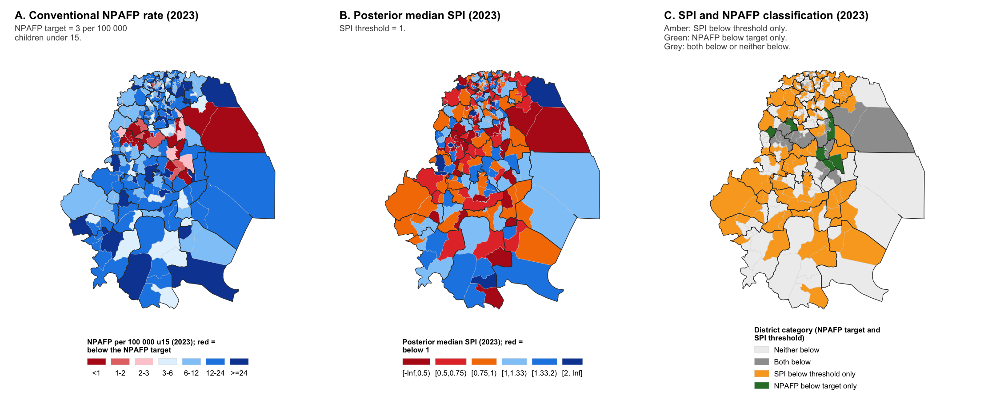
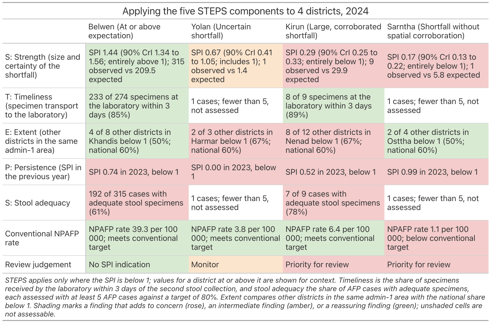
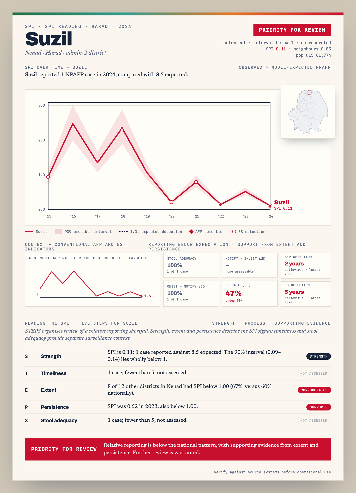

<!-- Edit spi-field-guide.Rmd.orig, not the .Rmd. Knit with
     Rscript --no-init-file vignettes/precompile.R spi-field-guide -->


The STEPS field guide combines SPI with timeliness, stool adequacy, and findings from nearby districts and earlier years. This article uses synthetic data to build the guide, change review settings, and create district reports.

## From SPI to review

The field guide starts from a `spi_compare_npafp()` result, which classifies each district-year by its SPI and the conventional NPAFP target. This code fits the model, calculates annual and monthly SPI, and builds that comparison. [Getting started with SPI](spi-getting-started.html) explains the first two steps.


``` r
library(spi)
synth <- synth_surveillance

fit <- spi_expected(
  cases = synth$cases,
  population = synth$population,
  adjacency = synth$boundaries,
  id_col = "adm2_guid",
  n_draws = 500,
  seed = 42,
  verbose = FALSE
)

spi_year <- spi_index(fit, level = "district_year")
spi_month <- spi_index(fit, level = "district_month")
```

Compare each district-year's SPI with the NPAFP target used here: 3 non-polio AFP cases per 100,000 under-15 person-years, matching the study definition. Programmes should use the target that applies in their setting. The four categories show where the two measures agree or differ. The `"SPI below threshold only"` category identifies districts that meet the NPAFP target but have an SPI below 1.


``` r
comparison <- spi_compare_npafp(
  spi = spi_year,
  cases = synth$cases,
  population = synth$population,
  boundaries = synth$boundaries,
  spi_threshold = 1,
  spi_rule = "median",
  npafp_target = 3,
  verbose = FALSE
)
```

Count the district-years in each category:


``` r
comparison$district_year |>
  dplyr::count(category, name = "district_years", .drop = FALSE)
#> # A tibble: 4 x 2
#>   category                 district_years
#>   <fct>                             <int>
#> 1 Neither below                       975
#> 2 SPI below threshold only           1057
#> 3 NPAFP below target only              74
#> 4 Both below                          254
```

Three panels for one year show the conventional NPAFP rate, the posterior median SPI, and the SPI and NPAFP category of each district:


``` r
spi_compare_npafp_maps(comparison, boundaries = synth$boundaries, year = 2023)
```



## The five STEPS components

`spi_field_guide()` applies the five STEPS components to relative reporting shortfalls. Three describe the SPI signal itself (strength, extent, and persistence); two are separate process indicators (timeliness and stool adequacy):

| Letter | Component | What it asks |
| --- | --- | --- |
| S | Strength | How large is the shortfall, and does the 90% credible interval lie entirely below the reference value of 1? |
| T | Timeliness | Are specimens reaching the laboratory within 3 days? |
| E | Extent | Is an SPI below the chosen cutoff more common among other districts in the same area than nationally? |
| P | Persistence | Was SPI also below the chosen cutoff in the previous year? |
| S | Stool adequacy | Were two adequate stool specimens collected? |

STEPS is not a combined score. Extent and persistence provide contextual evidence about whether a relative reporting shortfall is shared with nearby districts or repeated over time. Timeliness and stool adequacy describe separate dimensions of surveillance and do not change the label generated by the package. The timeliness component uses specimen transport only, not notification or investigation timeliness.

## Prepare process data

Timeliness and stool adequacy come from district-year AFP process counts, passed through `process`. `synth$afp_process` contains the required columns:


``` r
head(synth$afp_process)
#> # A tibble: 6 x 6
#>   adm2_guid               year n_cases n_adequate n_transport n_transport_timely
#>   <chr>                  <int>   <int>      <int>       <int>              <int>
#> 1 {01325AA0-BEA1-66FE-9~  2015       1          1           1                  0
#> 2 {01325AA0-BEA1-66FE-9~  2016       2          2           2                  2
#> 3 {01325AA0-BEA1-66FE-9~  2017       0          0           0                  0
#> 4 {01325AA0-BEA1-66FE-9~  2018       2          1           2                  1
#> 5 {01325AA0-BEA1-66FE-9~  2019       5          4           5                  3
#> 6 {01325AA0-BEA1-66FE-9~  2020       2          2           2                  2
```

`n_cases` is the number of AFP cases and `n_adequate` the number with adequate stool specimens. `n_transport` is the number of cases with both a second stool collection date and a laboratory receipt date, and `n_transport_timely` is the number of those received by the laboratory within 3 days. A component raises concern when its percentage is below `process_target` (80 by default), and it is not assessed when the district has fewer than `process_min_cases` cases (5 by default).

## Run the field guide

Supply AFP process counts through `process`. Optional `adjacency`, `spi_month`, `detections`, and `es` inputs add neighbouring-district, seasonal, and poliovirus detection context; they do not change the review label.


``` r
# optional AFP poliovirus detection records, used only as supporting context
detections <- synth$virus_outcome |>
  dplyr::filter(any_virus == 1) |>
  dplyr::select(adm2_guid, year)

fg <- spi_field_guide(
  comparison = comparison,
  process = synth$afp_process,
  adjacency = fit$adjacency,
  spi_month = spi_month,
  detections = detections,
  es = synth$es_district_year,
  es_col = "n_positive",
  spi_cut = 1,
  verbose = FALSE
)

fg
#> # A tibble: 3 x 3
#>   verdict                 n   pct
#>   <chr>               <int> <dbl>
#> 1 Priority for review    85  36  
#> 2 Monitor                57  24.2
#> 3 No SPI indication      94  39.8
#> # A tibble: 85 x 11
#>    district   obs   exp   spi cri       npafp extent persist transport adequacy
#>    <chr>    <int> <dbl> <dbl> <chr>     <dbl> <lgl>  <lgl>       <dbl>    <dbl>
#>  1 Khandor      0   2.4  0    0.00-0.00   0   TRUE   TRUE           NA       NA
#>  2 Vasheth      0   0.8  0    0.00-0.00   0   TRUE   FALSE          NA       NA
#>  3 Arddor       0   1.7  0    0.00-0.00   0   TRUE   TRUE           NA       NA
#>  4 Ardor        0   1.2  0    0.00-0.00   0   TRUE   TRUE           NA       NA
#>  5 Doloth       0   1.1  0    0.00-0.00   0   TRUE   TRUE           NA       NA
#>  6 Raenan       0   1.1  0    0.00-0.00   0   TRUE   TRUE           NA       NA
#>  7 Chakis       0   1.9  0    0.00-0.00   0   TRUE   TRUE           NA       NA
#>  8 Vashoth      0   2.3  0    0.00-0.00   0   TRUE   TRUE           NA       NA
#>  9 Suzil        1   8.5  0.11 0.09-0.14   1.6 TRUE   TRUE          100      100
#> 10 Nentha       2  16.4  0.12 0.10-0.14   2   TRUE   FALSE         100      100
#> # i 75 more rows
#> # i 1 more variable: verdict <chr>
```

## Review labels

The field guide generates three review labels:

- **Priority for review:** the SPI is below the cutoff, its 90% interval is entirely below 1, and extent or persistence raises concern.
- **Monitor:** the SPI is below the cutoff, but the conditions for `Priority for review` are not all met.
- **No SPI indication:** the SPI is at or above the cutoff. Routine surveillance and review based on other indicators continue.

The meaning of `No SPI indication` depends on the SPI rule. Under the default median rule, it means the SPI median is at or above the cutoff. Under the interval rule, described below, it also includes district-years whose 90% interval includes 1.

These labels organise review; they are not validated measures of surveillance adequacy or automatic recommendations for field action.

`summary(fg)` reports how often each STEPS component raises concern. `spi_field_guide_help()` explains the components and four worked examples in the console.

## Changing `spi_cut`

Set `spi_cut` to `0.80`, `0.60`, or `0.40` to focus on progressively larger relative shortfalls. These are practical review choices, not validated action thresholds.

| Chosen SPI cutoff | Districts included | Interpretation with national centring |
| --- | --- | --- |
| `1.00` (package default) | SPI below 1 | District O:E below national O:E |
| `0.80` | SPI below 0.80 | District O:E >20% below national O:E |
| `0.60` | SPI below 0.60 | District O:E >40% below national O:E |
| `0.40` | SPI below 0.40 | District O:E >60% below national O:E |

This table assumes `centre = "national"`, the default. With `centre = "none"`, the same cutoffs apply to the uncentred district O:E. These cutoffs help focus review; they are not validated boundaries between adequate and inadequate surveillance. Continue to review concerns from timeliness, stool adequacy, or other indicators even when a district is above the chosen SPI cutoff.

Changing `spi_cut` changes which district-years enter review and how extent and persistence are assessed. The strength check still compares the 90% credible interval with 1. To use the same cutoff in the comparison, also set `spi_threshold` in `spi_compare_npafp()`. Record the cutoff with the results.

The labels for the latest year at three cutoffs show the effect. The context inputs do not affect the label, so they are left out here:


``` r
label_counts <- function(comparison, cut = 1) {
  guide <- spi_field_guide(
    comparison = comparison,
    process = synth$afp_process,
    spi_cut = cut,
    verbose = FALSE
  )

  dplyr::count(guide$focal, verdict, name = "district_years")
}

purrr::map(c(1, 0.8, 0.6), function(cut) {
  label_counts(comparison, cut) |>
    dplyr::mutate(spi_cut = cut)
}) |>
  purrr::list_rbind() |>
  dplyr::arrange(dplyr::desc(spi_cut), verdict)
#> # A tibble: 9 x 3
#>   verdict             district_years spi_cut
#>   <fct>                        <int>   <dbl>
#> 1 Priority for review             85     1  
#> 2 Monitor                         57     1  
#> 3 No SPI indication               94     1  
#> 4 Priority for review             57     0.8
#> 5 Monitor                         31     0.8
#> 6 No SPI indication              148     0.8
#> 7 Priority for review             33     0.6
#> 8 Monitor                         17     0.6
#> 9 No SPI indication              186     0.6
```

## Changing the classification rule

`spi_rule` decides which district-years count as having an SPI below the threshold:

- `spi_rule = "median"`, the default in `spi_compare_npafp()`, uses `spi_median` alone.
- `spi_rule = "interval"` also requires the upper bound of the 90% credible interval, `spi_q95`, to be below 1.

`spi_field_guide()` takes the rule from the comparison unless its own `spi_rule` argument is set. Under the interval rule, a district-year whose interval includes 1 receives `No SPI indication` rather than `Monitor`. Extent and persistence still use the median. Record the rule with the results.


``` r
comparison_interval <- spi_compare_npafp(
  spi = spi_year,
  cases = synth$cases,
  population = synth$population,
  boundaries = synth$boundaries,
  spi_threshold = 1,
  spi_rule = "interval",
  npafp_target = 3,
  verbose = FALSE
)

dplyr::bind_rows(
  median = dplyr::count(comparison$district_year, category, .drop = FALSE),
  interval = dplyr::count(
    comparison_interval$district_year, category, .drop = FALSE
  ),
  .id = "spi_rule"
)
#> # A tibble: 8 x 3
#>   spi_rule category                     n
#>   <chr>    <fct>                    <int>
#> 1 median   Neither below              975
#> 2 median   SPI below threshold only  1057
#> 3 median   NPAFP below target only     74
#> 4 median   Both below                 254
#> 5 interval Neither below             1250
#> 6 interval SPI below threshold only   782
#> 7 interval NPAFP below target only     98
#> 8 interval Both below                 230

dplyr::bind_rows(
  median = label_counts(comparison),
  interval = label_counts(comparison_interval),
  .id = "spi_rule"
)
#> # A tibble: 6 x 3
#>   spi_rule verdict             district_years
#>   <chr>    <fct>                        <int>
#> 1 median   Priority for review             85
#> 2 median   Monitor                         57
#> 3 median   No SPI indication               94
#> 4 interval Priority for review             85
#> 5 interval Monitor                         22
#> 6 interval No SPI indication              129
```

## Field guide table

Use `spi_field_guide_table()` to create a `gt` or `flextable` report. `layout = "worked"` puts the STEPS components in rows and selects four districts with different findings; `layout = "scan"` puts districts in rows for scanning a longer list. Cells are coloured by level of concern.


``` r
spi_field_guide_table(fg, engine = "gt", layout = "worked")
```



## District report

Create an A4 report for one district, with its SPI trend, map, STEPS findings, and detection context. Pass `indicators_df` to add the NPAFP rate over time and tiles for stool adequacy, timeliness, and the enterovirus (EV) isolation rate from environmental samples. The example simulates the notification-to-investigation and EV figures. Set `path` to save HTML and PNG files:


``` r
source(system.file("examples", "pager_indicators.R", package = "spi"))
indicators <- example_indicators(fg)

spi_field_guide_pager(
  fg, district = "Tirwen", boundaries = synth$boundaries,
  id_col = "adm2_guid", indicators_df = indicators, path = "reports/"
)
```

The report below shows the district with the lowest non-zero SPI among those labelled `Priority for review` in the latest year:



## Optional context

The `detections`, `es`, `adjacency`, and `spi_month` inputs add context to the field guide and the pager: AFP poliovirus detections, ES detections, a comparison with neighbouring districts, and the seasonal pattern of monthly SPI. They help a reviewer judge a shortfall, but they do not determine the label.
