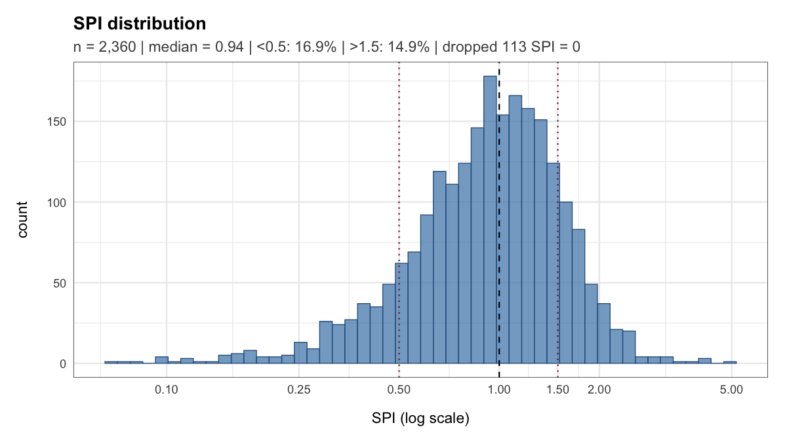
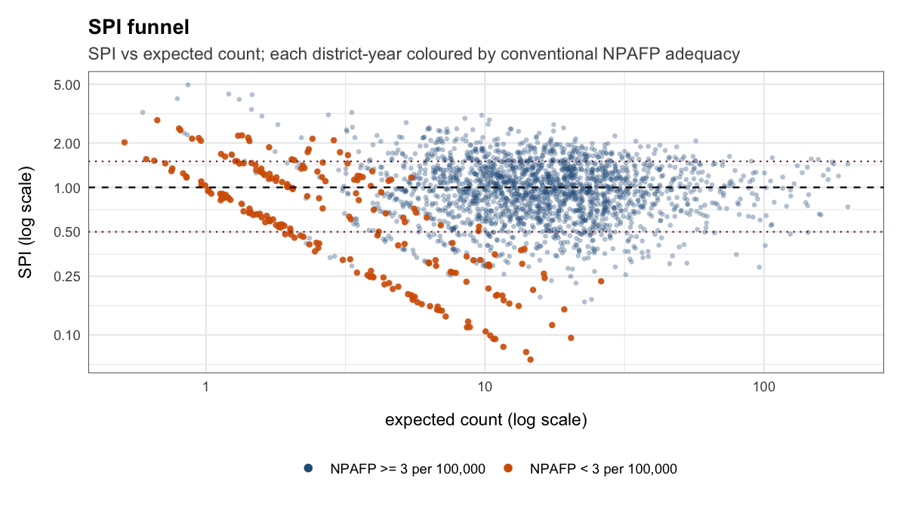
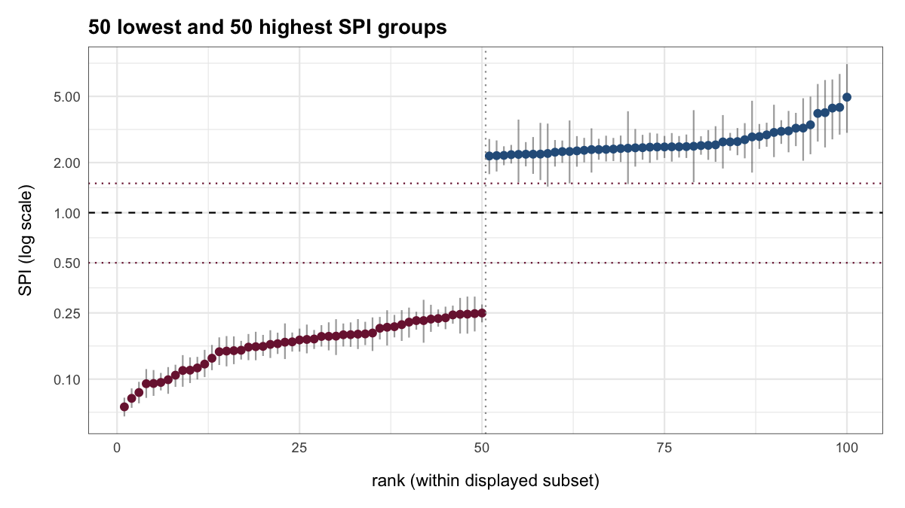
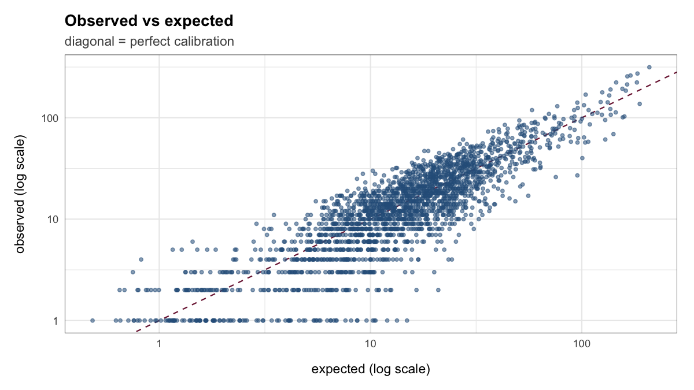

<!-- Edit spi-getting-started.Rmd.orig, not the .Rmd. Knit with
     Rscript --no-init-file vignettes/precompile.R spi-getting-started -->


This article covers the model-based SPI, calculated with `spi_index()`. It uses the bundled synthetic data to check inputs, calculate and plot SPI, and choose a reporting year that ends in a month other than December. For the direct SPI, which needs no model fit, see [The direct SPI](spi-direct.html). [Interpreting SPI alongside AFP indicators](spi-interpretation.html) explains what the results mean.

The outputs shown here were computed with INLA when the article was built.

## Input data

The model-based SPI needs three inputs, all using the same district ID column. [Preparing data for SPI](spi-data-preparation.html) shows how to prepare them:

- monthly NPAFP case counts, one row per district and month;
- annual under-15 population, one row per district and year;
- district boundaries as an `sf` object.

If you have POLIS access under a GPEI data-sharing agreement, [polished](https://truenomad.github.io/polished/) can retrieve and clean these inputs from POLIS.

The bundled `synth_surveillance` data cover 236 districts in the fictional country Harad, from 2015 to 2024. The district ID column is `adm2_guid`:


``` r
library(spi)
synth <- synth_surveillance

names(synth$cases)
#> [1] "adm2_guid" "month"     "count"
names(synth$population)
#> [1] "adm2_guid" "year"      "pop_u15"
names(synth$boundaries)
#> [1] "adm2_guid" "adm2_name" "adm1_name" "adm0_name" "geom"
```

`month` is the first day of each month, `count` is the number of NPAFP cases reported in that month, and `pop_u15` is the under-15 population for the year. Months with no cases should be present with a count of zero.

### Check the inputs first

Use `spi_check_inputs()` to check case counts, population denominators, and district boundaries before fitting the model. It reports mismatched district IDs, missing months, and other issues as errors, warnings, or notes. `spi_index()` also runs this check before each fit and stops on errors.


``` r
spi_check_inputs(
  cases = synth$cases,
  population = synth$population,
  shapefile = synth$boundaries,
  id_col = "adm2_guid"
)
#> 
#> -- spi input check -------------------------------------------------------------
#> v All input checks passed -- 236 districts x 120 months (2015-01 to 2024-12).
```

Here is the report for data with one negative count and three missing months:


``` r
bad_cases <- synth$cases |>
  # set the first count to -1 to simulate a data-entry error
  dplyr::mutate(
    count = dplyr::if_else(dplyr::row_number() == 1, -1, count)
  ) |>
  # remove three district-months to simulate missing records
  dplyr::slice(-(2:4))

spi_check_inputs(
  cases = bad_cases,
  population = synth$population,
  shapefile = synth$boundaries,
  id_col = "adm2_guid"
)
#> 
#> -- spi input check -------------------------------------------------------------
#> i 236 districts x 120 months (2015-01 to 2024-12)
#> x 1 case row has negative counts
#> ! 3 district-months missing from the case table
#> --------------------------------------------------------------------------------
#> x 1 error -- resolve before fitting.
```

## Calculate SPI

`spi_index()` estimates each assessment year's expected counts from the preceding years only. For each year, it fits the model using earlier months and predicts the expected counts for the year being assessed. It then compares that year's reported counts with the prediction. This is how SPI would be updated each year in routine use, and it is the approach used in the accompanying study.

`first_assessment` sets the first year to assess. The default `min_history = 3` requires three years of data before it, so with data from 2015 the first assessment year is 2018. Passing the district boundaries as `adjacency` builds the neighbour graph internally. `n_draws` sets how many samples from the fitted model are used to calculate the SPI intervals. These samples are called posterior draws. `seed` controls the random sampling so results can be reproduced. Each fit requires INLA and can take several minutes.


``` r
spi_year <- spi_index(
  cases = synth$cases,
  population = synth$population,
  adjacency = synth$boundaries,
  first_assessment = 2018,
  id_col = "adm2_guid",
  n_draws = 500,
  seed = 42,
  verbose = FALSE
)
```

`spi_year$windows` lists the months in each assessment year and the earlier months used to fit its model:


``` r
spi_year$windows
#> # A tibble: 7 x 7
#>    year window_start window_end training_start training_end months districts
#>   <int> <date>       <date>     <date>         <date>        <int>     <int>
#> 1  2018 2018-01-01   2018-12-01 2015-01-01     2017-12-01       12       236
#> 2  2019 2019-01-01   2019-12-01 2015-01-01     2018-12-01       12       236
#> 3  2020 2020-01-01   2020-12-01 2015-01-01     2019-12-01       12       236
#> 4  2021 2021-01-01   2021-12-01 2015-01-01     2020-12-01       12       236
#> 5  2022 2022-01-01   2022-12-01 2015-01-01     2021-12-01       12       236
#> 6  2023 2023-01-01   2023-12-01 2015-01-01     2022-12-01       12       236
#> 7  2024 2024-01-01   2024-12-01 2015-01-01     2023-12-01       12       236
```

`spi_index()` sums observed and expected counts to the chosen level and calculates SPI for each posterior draw. Annual SPI is generally more stable for review because many districts report few AFP cases per month. Monthly SPI helps show how reporting varies within a year. Each call refits the model for every assessment year, so these take as long as the first:


``` r
spi_raw <- spi_index(
  cases = synth$cases,
  population = synth$population,
  adjacency = synth$boundaries,
  first_assessment = 2018,
  centre = "none",
  id_col = "adm2_guid"
)
spi_month <- spi_index(
  cases = synth$cases,
  population = synth$population,
  adjacency = synth$boundaries,
  first_assessment = 2018,
  level = "district_month",
  id_col = "adm2_guid"
)
```

With `centre = "national"`, the default, each district's observed-to-expected ratio is divided by the national ratio for the same period. With `centre = "none"`, SPI is the uncentred district observed-to-expected ratio. [Interpreting SPI](spi-interpretation.html#national-centring) explains the difference with a worked example.

## Understand the output

`as_tibble()` returns one row per district and period. `observed` is the reported count for the period. `spi_median` is the central SPI estimate (the posterior median). `spi_q05` and `spi_q95` are the lower and upper limits of its 90% credible interval. The interval reflects uncertainty in expected counts, holding observed counts fixed.


``` r
spi_year |>
  tibble::as_tibble() |>
  dplyr::select(adm2_guid, year, observed, spi_median, spi_q05, spi_q95) |>
  dplyr::slice_head(n = 6)
#> # A tibble: 6 x 6
#>   adm2_guid                             year observed spi_median spi_q05 spi_q95
#>   <chr>                                <dbl>    <int>      <dbl>   <dbl>   <dbl>
#> 1 {01325AA0-BEA1-66FE-9B5C-88AA603382~  2018        2      0.883   0.489   1.65 
#> 2 {01325AA0-BEA1-66FE-9B5C-88AA603382~  2019        5      1.98    1.13    3.71 
#> 3 {01325AA0-BEA1-66FE-9B5C-88AA603382~  2020        2      1.17    0.703   2.00 
#> 4 {01325AA0-BEA1-66FE-9B5C-88AA603382~  2021        2      1.08    0.621   1.91 
#> 5 {01325AA0-BEA1-66FE-9B5C-88AA603382~  2022        2      0.818   0.453   1.44 
#> 6 {01325AA0-BEA1-66FE-9B5C-88AA603382~  2023        1      0.361   0.205   0.593
```


::: {.alert .alert-info}
A zero SPI does not imply zero uncertainty about surveillance. When no cases are observed, the ratio is zero for every posterior draw of the expected count, so the reported SPI interval is also zero.
:::

`spi_year$national` reports the national observed-to-expected ratio for each year (`national_oe`). Centred SPI divides each district's ratio by this value, so review it separately: district SPI can stay unchanged when district and national ratios change together.


``` r
spi_year$national
#> # A tibble: 7 x 5
#>    year national_observed national_expected national_oe districts
#>   <dbl>             <int>             <dbl>       <dbl>     <int>
#> 1  2018              4768             4298.       1.11        236
#> 2  2019              5558             4529.       1.23        236
#> 3  2020              3153             4808.       0.656       236
#> 4  2021              3372             4579.       0.736       236
#> 5  2022              4578             4460.       1.03        236
#> 6  2023              5246             4557.       1.15        236
#> 7  2024              6085             4683.       1.30        236
```

`summary()` gives diagnostics across all district-years, including the median SPI, the overall observed-to-expected ratio, and the share of credible intervals that exclude 1. A `flag` shows that a summary falls outside a range set by the package. These ranges help identify results to inspect; they have not been validated as tests of surveillance quality or model fit:


``` r
summary(spi_year)
#> # A tibble: 12 x 3
#>    metric                      value  flag 
#>    <chr>                       <chr>  <chr>
#>  1 median SPI                  0.905  pass 
#>  2 calibration ratio (obs/exp) 1.003  pass 
#>  3 log-SPI skewness            -0.681 flag 
#>  4 % with CrI excluding 1      51.6   flag 
#>  5 % SPI < 0.5                 20.3   <NA> 
#>  6 % SPI > 1.5                 17.6   <NA> 
#>  7 SPI q05                     0      <NA> 
#>  8 SPI q25                     0.577  <NA> 
#>  9 SPI q75                     1.312  <NA> 
#> 10 SPI q95                     2.079  <NA> 
#> 11 n groups                    1,652  <NA> 
#> 12 n low_information           19     <NA>
```

## Plots

`plot()` offers four views. The default `distribution` view shows how SPI values are distributed relative to the reference value of 1:


``` r
plot(spi_year)
```



The `funnel` view plots SPI against the expected count. Ratios based on small expected counts can vary widely, so inspect them with their credible intervals. Points are coloured by whether the district-year met the conventional NPAFP target:


``` r
plot(spi_year, type = "funnel")
```



The `caterpillar` view shows the lowest and highest SPI values with their credible intervals:


``` r
plot(spi_year, type = "caterpillar")
```



The `calibration` view compares observed with expected counts. Points on the diagonal have observed counts equal to their expected counts:


``` r
plot(spi_year, type = "calibration")
```



## Non-calendar and rolling years

Set `year_end_month` to use a reporting year other than January to December. With `year_end_month = 4`, each reporting year runs from May to April and is labelled by its ending year: May 2023 to April 2024 is labelled 2024. Its expected counts are predicted using data up to April 2023. The first May to April year with three years of data before it is 2019:


``` r
spi_may_apr <- spi_index(
  cases = synth$cases,
  population = synth$population,
  adjacency = synth$boundaries,
  first_assessment = 2019,
  last_assessment = 2024,
  year_end_month = 4,
  id_col = "adm2_guid",
  n_draws = 500,
  seed = 42,
  verbose = FALSE
)

spi_may_apr$windows
#> # A tibble: 6 x 7
#>    year window_start window_end training_start training_end months districts
#>   <int> <date>       <date>     <date>         <date>        <int>     <int>
#> 1  2019 2018-05-01   2019-04-01 2015-01-01     2018-04-01       12       236
#> 2  2020 2019-05-01   2020-04-01 2015-01-01     2019-04-01       12       236
#> 3  2021 2020-05-01   2021-04-01 2015-01-01     2020-04-01       12       236
#> 4  2022 2021-05-01   2022-04-01 2015-01-01     2021-04-01       12       236
#> 5  2023 2022-05-01   2023-04-01 2015-01-01     2022-04-01       12       236
#> 6  2024 2023-05-01   2024-04-01 2015-01-01     2023-04-01       12       236
```

When the data end before the last year closes, the final assessment covers fewer than 12 months. `spi_index()` keeps it with a warning, and `n_months` shows how many months each district-year covers.

For a rolling 12-month SPI that is updated every month, rerun `spi_index()` each month with `year_end_month` set to the month that has just closed. Each run covers the 12 months ending in that month and uses earlier months to predict the expected counts.

Use a consistent model specification, centring setting, and reporting year when comparing years.

## Next steps

[Interpreting SPI alongside AFP indicators](spi-interpretation.html) explains how to interpret these results with the conventional NPAFP rate, timeliness, and stool adequacy. [How do I use SPI to review districts?](spi-field-guide.html) shows how to organise a district review once SPI identifies a shortfall.
