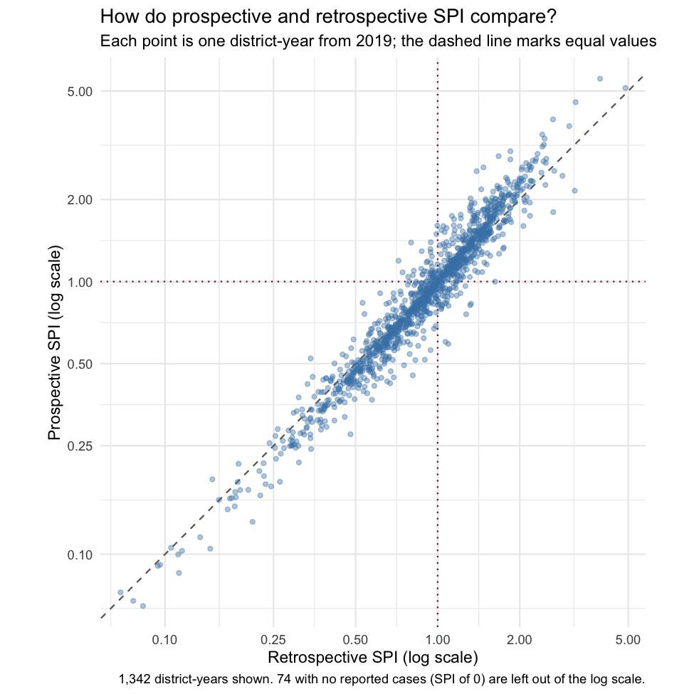

<!-- Edit spi-model-options.Rmd.orig, not the .Rmd. Knit with
     Rscript --no-init-file vignettes/precompile.R spi-model-options -->


The default SPI model uses no covariates and negative binomial overdispersion. This article shows how to assess the effects of covariates, observation models, spatial structure, and the training period.

The examples use the bundled synthetic data. Model fitting requires INLA and can take several minutes.


``` r
library(spi)
synth <- synth_surveillance
```

## Adjusting for covariates

Covariates are optional and are not part of the default SPI used in the accompanying study. Covariate adjustment changes the estimand: a covariate-adjusted SPI no longer answers the same question as the default SPI. Pass district-year covariates to `spi_expected()` through the `covariates` argument. The example data include DTP3 coverage, urban population share, and travel time to care:


``` r
synth$covariates |>
  dplyr::slice_head(n = 6)
#>                                adm2_guid year dtp3 urban_prop travel_time_min
#> 1 {01325AA0-BEA1-66FE-9B5C-88AA603382F3} 2015 84.8      0.566            15.9
#> 2 {01325AA0-BEA1-66FE-9B5C-88AA603382F3} 2016 89.9      0.566            16.5
#> 3 {01325AA0-BEA1-66FE-9B5C-88AA603382F3} 2017 89.9      0.566            17.1
#> 4 {01325AA0-BEA1-66FE-9B5C-88AA603382F3} 2018 87.3      0.566            23.2
#> 5 {01325AA0-BEA1-66FE-9B5C-88AA603382F3} 2019 89.9      0.566            19.3
#> 6 {01325AA0-BEA1-66FE-9B5C-88AA603382F3} 2020 87.6      0.566            22.1
```

Pass them in, log-transforming the skewed travel-time column:


``` r
fit_adj <- spi_expected(
  cases = synth$cases,
  population = synth$population,
  adjacency = synth$boundaries,
  covariates = synth$covariates,
  log_transform = "travel_time_min",
  id_col = "adm2_guid",
  n_draws = 500,
  seed = 42,
  verbose = FALSE
)
```

Effects are reported as rate ratios per standard deviation of the covariate. The model standardises covariates internally. Here are the three covariate effects, excluding the seasonal terms:


``` r
summary(fit_adj)$effects |>
  dplyr::filter(covariate %in% c("dtp3", "urban_prop", "travel_time_min")) |>
  dplyr::select(covariate, rr_median, rr_q025, rr_q975, signif)
#> # A tibble: 3 x 5
#>   covariate       rr_median rr_q025 rr_q975 signif
#>   <chr>               <dbl>   <dbl>   <dbl> <lgl> 
#> 1 dtp3                1.00    0.953    1.05 FALSE 
#> 2 urban_prop          1.03    0.938    1.13 FALSE 
#> 3 travel_time_min     0.991   0.968    1.01 FALSE
```

These coefficients describe conditional associations within the expected-count model and should not be interpreted causally.

## Compare overdispersion options

Compare Poisson, Poisson with an observation-level random effect, and negative binomial models:


``` r
od <- spi_compare_overdispersion(
  cases = synth$cases,
  population = synth$population,
  adjacency = synth$boundaries,
  id_col = "adm2_guid",
  specs = c("none", "iid", "nb"),
  n_draws = 100,
  verbose = FALSE
)
```


``` r
od$summary
#> # A tibble: 3 x 11
#>   spec  n_obs    dic   waic p_eff sd_spatial phi_spatial phi_pegged sd_extra
#>   <chr> <int>  <dbl>  <dbl> <dbl>      <dbl>       <dbl> <lgl>         <dbl>
#> 1 none  28320 81917. 81996.  241.      0.865       0.928 FALSE        NA    
#> 2 iid   28320 79563. 79528. 5667.      0.864       0.926 FALSE         0.423
#> 3 nb    28320 80299. 80296.  240.      0.868       0.934 FALSE        NA    
#> # i 2 more variables: cpo_valid <dbl>, pit_ks <dbl>
```

`od$summary` has one row per observation model. DIC and WAIC compare model fit while allowing for complexity; lower values are preferred. The CPO column is the share of observations with a valid leave-one-out predictive value. The PIT statistic is the distance of the probability integral transform values from a uniform distribution, and smaller values indicate closer agreement with that reference distribution.

`od$recommendation` gives the model selected by the package's diagnostic rule, with its reasoning:


``` r
od$recommendation$choice
#> [1] "none"
od$recommendation$reasoning
#> [1] "Excluded: overfit p_eff > 20% of n (iid). Best PIT calibration among survivors (none, nb): none."
```

<details>
<summary>How the diagnostic rule selects a model</summary>

WAIC can favour a model with one random effect per observation even when that model overfits. `spi_compare_overdispersion()` therefore first excludes any model with valid CPO values for fewer than half of the observations, an effective number of parameters above 20% of the observations, or a BYM2 `phi` below 0.02 or above 0.98. Among the remaining models, it selects the one with the smallest PIT distance.

</details>

To skip the manual step, `spi_expected(overdispersion = "auto")` runs this same comparison internally and refits with the selected model. Here the diagnostic rule selects `overdispersion = "none"`. Negative binomial remains the package default because it is the pre-specified model used in the accompanying study; `overdispersion = "auto"` is an optional diagnostic workflow for other applications.

## Spatial structure

`spi_expected()` builds the neighbour graph itself when `adjacency` is an `sf` object. To inspect or reuse the graph, build it with `spi_adjacency()`:


``` r
adj <- spi_adjacency(synth$boundaries, id_col = "adm2_guid")
adj
#> Neighbour list object:
#> Number of regions: 236 
#> Number of nonzero links: 1,320 
#> Percentage nonzero weights: 2.3700 
#> Average number of links: 5.5932
```

Districts are neighbours when their boundaries touch at any point (`contiguity = "queen"`); `contiguity = "rook"` requires a shared edge. With `handle_islands = TRUE`, the default, a district with no neighbours is linked to its nearest district by centroid distance. A group of districts cut off from the rest stays a separate component, and the printed graph reports the number of disjoint connected subgraphs when there is more than one.

The spatial term is a BYM2 random effect (Riebler et al. 2016). It splits district-level variation into a spatially structured part, shared with neighbours, and an unstructured part specific to each district; `phi` is the share of that variation that is spatially structured. Where district information is sparse, partial pooling and spatial borrowing help estimate the expected count. This makes the estimate more stable, but it can pull an unusual district towards its neighbours.

## Prospective and retrospective fits

The default fit below uses all supplied years together. `spi_prospective()` refits the model for each assessment year using only the preceding years. The two are compared for the same district-years:


``` r
first_assessment <- 2019

fit <- spi_expected(
  cases = synth$cases,
  population = synth$population,
  adjacency = synth$boundaries,
  id_col = "adm2_guid",
  n_draws = 500,
  seed = 42,
  verbose = FALSE
)

retro <- spi_index(fit, level = "district_year", verbose = FALSE) |>
  tibble::as_tibble() |>
  dplyr::filter(year >= first_assessment) |>
  dplyr::select(adm2_guid, year, spi_retro = spi_median)
```


``` r
prosp <- spi_prospective(
  cases = synth$cases,
  population = synth$population,
  adjacency = synth$boundaries,
  first_assessment = first_assessment,
  id_col = "adm2_guid",
  n_draws = 500,
  seed = 42,
  verbose = FALSE
) |>
  tibble::as_tibble() |>
  dplyr::select(adm2_guid, year, spi_prosp = spi_median)
```


``` r
compare <- dplyr::inner_join(retro, prosp, by = c("adm2_guid", "year"))

compare |>
  dplyr::summarise(
    district_years = dplyr::n(),
    pearson = stats::cor(spi_retro, spi_prosp),
    spearman = stats::cor(spi_retro, spi_prosp, method = "spearman"),
    below_1_retro = sum(spi_retro < 1),
    below_1_prosp = sum(spi_prosp < 1),
    change_side = sum((spi_retro < 1) != (spi_prosp < 1))
  )
#> # A tibble: 1 x 6
#>   district_years pearson spearman below_1_retro below_1_prosp change_side
#>            <int>   <dbl>    <dbl>         <int>         <int>       <int>
#> 1           1416   0.957    0.970           816           814          94
```


``` r
compare_plot <- compare |>
  dplyr::filter(spi_retro > 0, spi_prosp > 0)

n_shown <- format(nrow(compare_plot), big.mark = ",")
n_zero <- nrow(compare) - nrow(compare_plot)
spi_breaks <- c(0.1, 0.25, 0.5, 1, 2, 5)

ggplot2::ggplot(compare_plot, ggplot2::aes(spi_retro, spi_prosp)) +
  ggplot2::geom_hline(yintercept = 1, linetype = "dotted", colour = "#7B1D3D") +
  ggplot2::geom_vline(xintercept = 1, linetype = "dotted", colour = "#7B1D3D") +
  ggplot2::geom_abline(
    slope = 1, intercept = 0, linetype = "dashed", colour = "grey40"
  ) +
  ggplot2::geom_point(colour = "#4682B4", alpha = 0.4, size = 1.2) +
  ggplot2::scale_x_log10(
    breaks = spi_breaks, expand = ggplot2::expansion(mult = 0.04)
  ) +
  ggplot2::scale_y_log10(
    breaks = spi_breaks, expand = ggplot2::expansion(mult = 0.04)
  ) +
  ggplot2::coord_equal() +
  ggplot2::labs(
    title = "How do prospective and retrospective SPI compare?",
    subtitle = glue::glue(
      "Each point is one district-year from {first_assessment}; ",
      "the dashed line marks equal values"
    ),
    caption = glue::glue(
      "{n_shown} district-years shown. {n_zero} with no reported ",
      "cases (SPI of 0) are left out of the log scale."
    ),
    x = "Retrospective SPI (log scale)",
    y = "Prospective SPI (log scale)"
  ) +
  ggplot2::theme_minimal()
```



The Pearson correlation between the two is 0.96 and the Spearman rank correlation is 0.97, but 94 of 1416 district-years fall on different sides of 1 depending on the fit.

In the retrospective fit, each assessed year contributes to its own expectation, so part of a decline in that year is absorbed into the expected count. In the prospective fit, the expectation for each year comes only from earlier years. Retrospective SPI describes the full fitted period; prospective SPI is designed for assessing each year against the information available before it. The accompanying study uses prospective assessment for this reason. Do not mix the two in one series.

## Sensitivity checks

Results can depend on the training period, observation model, covariates, centring, and reporting year. Several checks reuse fits already made in this article. Each counts the complete district-years with an SPI below 1. The count is a simple illustration of how classification changes between settings, not a measure of model performance:


``` r
count_below_1 <- function(index) {
  index |>
    tibble::as_tibble() |>
    dplyr::filter(n_months == 12) |>
    dplyr::summarise(
      district_years = dplyr::n(),
      below_1 = sum(spi_median < 1)
    )
}

dplyr::bind_rows(
  default = count_below_1(spi_index(fit, verbose = FALSE)),
  centre_none = count_below_1(
    spi_index(fit, centre = "none", verbose = FALSE)
  ),
  may_to_april = count_below_1(
    spi_index(fit, year_end_month = 4, verbose = FALSE)
  ),
  covariates = count_below_1(spi_index(fit_adj, verbose = FALSE)),
  poisson_iid = count_below_1(spi_index(od$fits$iid, verbose = FALSE)),
  .id = "setting"
)
#> # A tibble: 5 x 3
#>   setting      district_years below_1
#>   <chr>                 <int>   <int>
#> 1 default                2360    1315
#> 2 centre_none            2360    1302
#> 3 may_to_april           2124    1168
#> 4 covariates             2360    1310
#> 5 poisson_iid            2360    1301
```

The `poisson_iid` row reuses the comparison fit from `spi_compare_overdispersion()`, which kept 100 posterior draws. A different training period needs new prospective fits. Starting assessment in 2021 skips the earliest assessment years. It does not change the training history for years already included, because each fit still uses all preceding years:


``` r
prosp_later <- spi_prospective(
  cases = synth$cases,
  population = synth$population,
  adjacency = synth$boundaries,
  first_assessment = 2021,
  id_col = "adm2_guid"
)
```

Keep the chosen settings the same when comparing years, and report them with the results.
